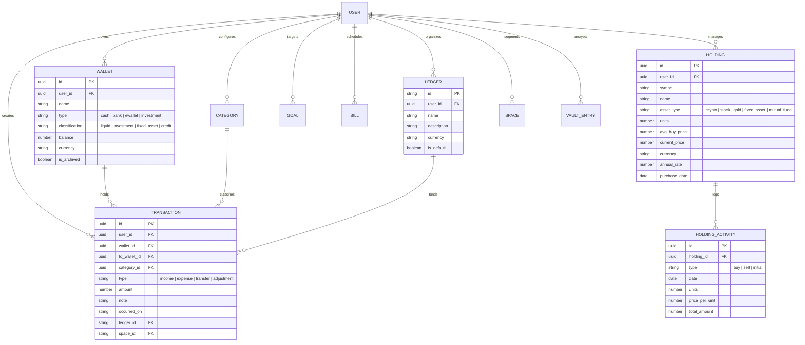

# Trouvaille: Private Financial Intelligence & Luxury Architectural System
### Comprehensive Technical Paper & System Specification
**Version:** 3.5.0 · **Classification:** Executive Technical Treatise & Architectural Blueprint · **Platform:** Native iOS & Web PWA  
**Author:** DeepMind Agentic Systems & Trouvaille Core Engineering  
**Revision Date:** September 2026  

---

## Executive Abstract

Modern personal financial software has largely devolved into fragmented, visually intrusive, and surveillance-heavy applications. The prevailing market standard relies on aggressive third-party data tracking, cartoonish rainbow gamification, rigid input forms that demand tedious manual bookkeeping, and floating-point arithmetic errors that compromise balance invariants over multi-year records.

**Trouvaille** was engineered as an uncompromising antidote: a local-first, zero-knowledge encrypted, private wealth operating system wrapped in a hyper-refined **Monochrome Apple Luxury Glassmorphism** interface. Built with **React 19**, **Vite 8**, **Tailwind CSS 4**, and native **Capacitor 8 iOS** runtime, Trouvaille harmonizes:

1. **Multi-Modal Cognitive & Physical Ingestion Ecosystem**: Real-time natural voice processing capable of decomposing compound spoken phrases into multiple discrete transactions, Indonesian colloquial slang decoding, phonetic auto-correction, on-device receipt OCR with Tesseract.js WASM, automated multi-bank statement parsers (BCA, Mandiri, Jenius, BNI), push notification transaction interception, contactless e-money NFC transit card balance readers (Flazz, e-money, TapCash, Brizzi, JakCard), and native **Apple Shortcuts & iPhone Back Tap Integrations** enabling instant voice logging via double-tap chassis gestures, Dynamic Island frosted glass modals, and Action Button hardware triggers.
2. **Silicon Valley Wealth Bento & Asset Valuation Engine**: Comprehensive multi-asset tracking covering crypto, US equities, Indonesian stocks (IDX), physical gold, mutual funds, and fixed assets with straight-line depreciation modeling, real-time live price feeds, automated USDT balance reconciliation, and staking yield tracking.
3. **Actuarial Simulation & Deep Telemetry Suite**: 10,000-iteration stochastic Monte Carlo wealth projections, FIRE retirement modeling (LeanFIRE, FatFIRE, CoastFIRE with 4% SWR), Debt Snowball and Avalanche payoff optimizers, 6-pillar financial health diagnostic scoring, hierarchical Category Sunburst charts, and interactive Recharts Sankey cashflow diagrams.
4. **Personal Financial Modeling & Zero-Based Budgeting**: Unified single-card Category Budget Deck, digital envelope allocations, Cashflow Pulse velocity, Expense Volatility Index, Liquidity Horizon metrics, and interactive What-If scenario forecasting.
5. **Cinematic Financial Analytics & Story Engine**: An expanded 11-slide *Financial Wrapped* story experience featuring novel visualization paradigms including the **Three-Tiered Executive Health & Velocity Score Matrix**, **Stacked Cascade Chart**, **Temporal Spending Heatmap Matrix**, **Concentric Vital Ratio Rings**, **Multi-Horizon Runway Projections**, and multi-year historical playback with Apple Liquid Glass HUD and screen-tap navigation.
6. **Apple Luxury Bento Hubs Console**: A completely reimagined Master Settings architecture featuring an Apple ID-style glass hero banner, 4 master bento hub cards (Financial Architecture, Automations & Shortcuts, Security & Vault, Preferences & Experience) with live real-time status badges, native 92dvh sliding bottom sheet panels, and an instant search overlay.
7. **Multi-Currency Engine & Strict Bicultural Non-Mixed Localization**: Dynamic multi-currency reactivity (IDR, USD, EUR, SGD, JPY, GBP) with offline cached exchange rates and strict 100% pure Indonesian / 100% pure English localization across all cards, modals, and telemetry sheets ("No Gado-Gado" invariant).
8. **Bank-Grade Data Integrity & Hardware Cryptography**: Deterministic arbitrary-precision mathematical operations, client-side AES-GCM 256-bit vault encryption with PBKDF2 key derivation, native Apple Face ID / Touch ID hardware gating with background auto-lock, and zero-barrier guest onboarding with 1-click cloud synchronization.
9. **Executive Dossier Generation**: On-device luxury PDF financial statement and balance sheet generation via jsPDF, adhering strictly to monochrome luxury typographic standards.
10. **Architectural Hardening & Archive Segregation**: Full codebase audit ensuring zero temporal dead zones, pure derived state execution eliminating cascading render cycles, and strict archival decoupling of legacy experiments (`src/archive/`) for maximum runtime efficiency.

This document serves as the definitive architectural whitepaper, technical specification, and exhaustive component catalog for Project Trouvaille.

---

## Table of Contents
1. [Vision, Ethos & Problem Space](#1-vision-ethos--problem-space)
2. [Design System: Monochrome Apple Luxury Glassmorphism & Ergonomics](#2-design-system-monochrome-apple-luxury-glassmorphism--ergonomics)
3. [Technology Stack & Runtime Architecture](#3-technology-stack--runtime-architecture)
4. [Data Domain, Accounting Invariants & Precision Math](#4-data-domain-accounting-invariants--precision-math)
5. [Multi-Modal Cognitive & Physical Ingestion Ecosystem](#5-multi-modal-cognitive--physical-ingestion-ecosystem)
6. [Asset Valuation, Portfolio Engine & Silicon Valley Wealth Bento](#6-asset-valuation-portfolio-engine--silicon-valley-wealth-bento)
7. [Actuarial Simulation, Deep Telemetry & Analytics Suite](#7-actuarial-simulation-deep-telemetry--analytics-suite)
8. [Exhaustive Page-by-Page Workstation, Feature, Card & Insight Specification](#8-exhaustive-page-by-page-workstation-feature-card--insight-specification)
   - 8.1 [Page 1: Login & Onboarding Workstation (`LoginPage.tsx`)](#81-page-1-login--onboarding-workstation-loginpagetsx)
   - 8.2 [Page 2: Executive Wealth Dashboard (`HomePage.tsx`) - 24 Cards & Widgets](#82-page-2-executive-wealth-dashboard-homepagetsx)
   - 8.3 [Page 3: Transaction Journal & Ledger (`TransactionsPage.tsx`)](#83-page-3-transaction-journal--ledger-transactionspagetsx)
   - 8.4 [Page 4: Silicon Valley Wealth Bento & Balance Sheet (`AssetsPage.tsx`) - 16 Cards & Matrices](#84-page-4-silicon-valley-wealth-bento--balance-sheet-assetspagetsx)
   - 8.5 [Page 5: Cashflow Calendar & Runway Forecaster (`CalendarPage.tsx`)](#85-page-5-cashflow-calendar--runway-forecaster-calendarpagetsx)
   - 8.6 [Page 6: Deep Telemetry & Actuarial Workstation (`StatisticsPage.tsx`) - 27 Cards & Reports](#86-page-6-deep-telemetry--actuarial-workstation-statisticspagetsx)
   - 8.7 [Page 7: Master Settings & Cryptographic Vault (`SettingsPage.tsx`) - Apple Luxury Bento Hubs Architecture](#87-page-7-master-settings--cryptographic-vault-settingspagetsx---apple-luxury-bento-hubs-architecture)
   - 8.8 [Global Ecosystem Sheets, Modals & Action Overlays](#88-global-ecosystem-sheets-modals--action-overlays)
9. [Personal Financial Modeling, Budget Decks & Cashflow Intelligence](#9-personal-financial-modeling-budget-decks--cashflow-intelligence)
10. [Cinematic Financial Wrapped & Visualization Paradigms](#10-cinematic-financial-wrapped--visualization-paradigms)
11. [Security, Cryptography, Multi-Currency & Offline Sync](#11-security-cryptography-multi-currency--offline-sync)
12. [Verification, Invariants & Test Coverage (41 Suites, 369 Tests)](#12-verification-invariants--test-coverage-41-suites-369-tests)
13. [Repository Architecture & Codebase Map](#13-repository-architecture--codebase-map)
14. [Strategic Roadmap & Evolution](#14-strategic-roadmap--evolution)

---

## 1. Vision, Ethos & Problem Space

### 1.1 The Critique of Conventional FinTech
The vast majority of consumer financial software suffers from systemic structural compromises:
- **Intrusive Data Monetization**: User financial records are uploaded unencrypted to centralized cloud databases, aggregated, and mined for targeted advertising, credit profiling, or sold to third-party data brokers.
- **Visual Cacophony**: Neon gradients, rainbow category badges, and colored native system emojis clutter interfaces, inducing cognitive fatigue and anxiety rather than calm mastery over one’s wealth.
- **Input Friction**: Adding a transaction requires up to 6–8 manual taps across modals, dropdowns, and datepickers, leading to user abandonment within weeks.
- **Arithmetic Frailty**: Reliance on naive JavaScript floating-point numbers results in cumulative roundoff errors (e.g. `0.1 + 0.2 === 0.30000000000000004`), degrading accounting trustworthiness over multi-year records.
- **Siloed Wealth Tracking**: Conventional trackers separate daily cash expenses from capital investments, crypto holdings, and fixed asset depreciation, forcing users to juggle multiple apps to understand their true net portfolio.

### 1.2 The Trouvaille Antidote
Trouvaille is built on four core pillars:
1. **Calm Sovereignty**: Financial tracking should feel like reviewing a private audit at an exclusive private bank—tranquil, dignified, tactile, and completely free from commercial clutter.
2. **Frictionless Velocity**: Transactions must be capturable in seconds through natural speech, receipt scans, bank statement imports, push notifications, or NFC card taps.
3. **Mathematical Determinism**: Financial invariants must hold true across all wallets, time horizons, currency conversions, and multi-ledger spaces without exception.
4. **Client-Side Sovereignty**: Data belongs exclusively to the user. All storage, encryption keys, and heuristic engines operate on-device first, synchronizing to the cloud only over zero-knowledge encrypted channels.

```
+---------------------------------------------------------------------------------------+
|                                    TROUVAILLE CORE                                    |
+--------------------------+----------------------------+-------------------------------+
|       UI / UX LAYER      |      INGESTION & INTEL     |        SECURITY & ACTUARIAL   |
|  Monochrome Apple Luxury |  Multi-NLP Compound Voice  |  AES-GCM 256-bit Vault        |
|  Urbanist Typography     |  Tesseract.js Client OCR   |  Apple Face ID / Touch ID     |
|  Zero-Emoji Rule         |  Bank Statement Importer   |  Monte Carlo Engine (10k)     |
|  Radial Arc Thumb Fan    |  Contactless E-Money NFC   |  FIRE & Debt Payoff Solvers   |
|  Dynamic Island Profile  |  Push Notification Parser  |  Deterministic Math Engine    |
|  Bento Grid & Deck View  |  Cognitive Merchant Memory |  Multi-Ledger Offline Sync    |
+--------------------------+----------------------------+-------------------------------+
```

---

## 2. Design System: Monochrome Apple Luxury Glassmorphism & Ergonomics

Trouvaille adheres to a strict architectural aesthetic documented in `GEMINI.md`.

### 2.1 The Monochromatic Palette
The visual hierarchy eliminates arbitrary rainbow category coloring in favor of deep obsidian depths, alabaster highlights, and layered light refractions:
- **Dark Mode (Primary Luxury)**:
  - Deep Obsidian Base: `#09090C` / `#121214`
  - Elevated Glass Layers: `rgba(255, 255, 255, 0.04)` to `rgba(255, 255, 255, 0.08)`
  - Frosted Hairline Borders: `1px solid rgba(255, 255, 255, 0.12)` to `rgba(255, 255, 255, 0.18)`
  - Fluted Glass Slat Texture: Repeating linear gradients with translucent vertical refractions
- **Light Mode (Alabaster Smoke)**:
  - Base: `#F4F4F7` / `#FFFFFF`
  - Frosted Milky Glass Accents: `rgba(0, 0, 0, 0.03)` with matte black structural dividers and subtle hairline boundaries
- **Accent Philosophy**: No neon greens or purples. Positive capital inflow is rendered in clean alabaster white or discreet positive luminance (`var(--accent)`); outflows are rendered in crisp typographic contrast.

### 2.2 Strict Zero-Emoji Rule (Architectural Rule 1)
> [!IMPORTANT]
> **NO NATIVE COLORED SYSTEM EMOJIS IN THE UI**  
> Native system emojis (📊, ⚡, 🗓️, 🎯, 🔔, ⏱️, 🥧, 📈, etc.) are strictly forbidden as UI controls, dashboard widgets, modal toggles, button icons, or navigation items.

- **Vector Outlines Only**: All visual indicators must strictly use vector outline/duotone icons from `lucide-react`.
- **Dimensional Rules**: Standard stroke widths are strictly constrained to `strokeWidth={1.5}` or `strokeWidth={1.75}`, with dimensions scaled between `14px` and `18px`.
- **Thematic Encapsulation**: Icons are housed in frosted squircle containers (`backdrop-blur-xl`, `border-white/10`) or inherit CSS variables (`var(--text-primary)`, `var(--text-secondary)`, `var(--text-tertiary)`).
- **Sole Permissible Exception**: User-customizable category avatars rendered through `IconRenderer.tsx`, never hardcoded system controls.

### 2.3 Ergonomics, Gestures & Apple Hardware Adaptation
- **Radial Arc Fan Layout**: The hold-gesture quick-add trigger deploys actions (Voice, Scan, Statement, Manual, Split) along an ergonomic circular arc centered on the user's thumb radius.
- **Dynamic Island Profile Flyout**: Seamlessly integrated into the top status bar, the profile header dynamically expands into a frosted luxury flyout menu (`ProfileMenuModal.tsx`) housing space switching, currency conversion, ledger selection, and security settings.
- **Dynamic Inset & Safe Areas**: All modal sheets, story wrappers, and navigation bars compute dynamic safe areas:
  $$\text{Top Inset} = \max(\text{env}(\text{safe-area-inset-top}, 0\text{px}) + 12\text{px}, 24\text{px})$$
  Ensuring seamless compatibility with the iOS Dynamic Island, camera notches, and home indicator bars.
- **4 Modular Dashboard Layout Presets**:
  - `minimal` (Minimal / True Simple): Distraction-free essential flow: Liquid Position $\to$ Liquidity Sources $\to$ Savings Ring + Activity Dot Matrix (Paired 2-column Bento) $\to$ Cashflow Pulse $\to$ Upcoming Bills $\to$ Recent Ledger.
  - `pulse` (Balanced / Daily Rhythm): Everyday financial tracking: Capital Overview $\to$ Action Required $\to$ Weekly Velocity Bar + Category Donut (Bento 1) $\to$ Cashflow Pulse $\to$ Upcoming Bills $\to$ Recent Transactions.
  - `horizon` (Horizon / Wealth Planning): Long-term survival buffer & wealth retention: Capital Overview $\to$ Runway + Health Meter (Bento 1) $\to$ Cashflow Pulse $\to$ Spending Stability $\to$ Goals $\to$ Commitments $\to$ Recent Transactions.
  - `executive` (Executive / Full Telemetry): Complete command center with 3 cleanly paired 2-column bentos (Velocity + Savings Ring, Runway + Health Gauge, Donut + Activity Heatmap) plus all macro telemetry.

### 2.4 Dynamic Notch, Dynamic Island & Floating Flyouts Rule (Architectural Rule 3)
Floating capsules, top flyout banners, and status controls must never employ hardcoded vertical top coordinates (such as `top-[24px]` or `top-3`) that collide with physical iPhone hardware cutouts:
- **Dynamic Coordinate Formula**:
  $$\text{Top Placement} = \max(\text{env}(\text{safe-area-inset-top}, 0\text{px}) + 18\text{px}, 28\text{px})$$
- **Centered Horizontal Constrainment**: Combined with `left-4 right-4 max-w-md mx-auto` to ensure uniform floating symmetry across all device aspect ratios (from compact iPhones to iPads and desktop browser viewports).
- Applied across all floating system surfaces including [`ClipboardTransactionBanner`](file:///d:/Project/Trouvaille/src/components/common/ClipboardTransactionBanner.tsx), [`ProfileMenuModal`](file:///d:/Project/Trouvaille/src/components/home/ProfileMenuModal.tsx), and [`PullToRefreshIndicator`](file:///d:/Project/Trouvaille/src/components/ui/PullToRefreshIndicator.tsx).

### 2.5 Bottom Sheet & Sliding Panel Architecture Rule (Architectural Rule 5)
Bottom sheets and sliding action panels in Trouvaille follow a unified single-scroll container paradigm:
- **Zero Artificial Inner Height Restrictions**: No child component or grid inside a `BottomSheet` is permitted to impose arbitrary low height caps (`max-h-[55vh]`, `max-h-[50vh]`, `max-h-[320px]`, `max-h-[160px]`) paired with inner `overflow-y-auto`. Nested scrollbars within modal panels are strictly prohibited.
- **Unified 92dvh Scroll Container**: The parent `BottomSheet` manages a single, smoothly decelerated inertial scroll container (`min-h-0 flex-1 overflow-y-auto overscroll-contain`) expanding naturally up to `92dvh`.
- **iOS Home Indicator Inset Standard**: All bottom sheets, docked action bars, and footer containers enforce a generous bottom safe-area inset:
  $$\text{Padding Bottom} = \max(\text{env}(\text{safe-area-inset-bottom}, 0\text{px}) + 12\text{px}, 24\text{px})$$
  Ensuring bottommost action buttons, pills, and cards are never obstructed or clipped by the physical iOS home swipe bar.

### 2.6 Modal & Customization Settings Layout Rule
Customization dialogs and settings drawers implement a strict typographic and aesthetic hierarchy:
- **Two-Line Feature Hierarchy**:
  - *Top Line*: Feature Title (`text-[13px] font-semibold text-[var(--text-primary)]`).
  - *Second Line*: Concise functional description (`text-[11px] text-[var(--text-tertiary)]`).
  - *Far Right*: High-contrast Apple iOS toggle switch (`ToggleSwitch.tsx`, `w-10 h-5.5` with `w-4.5 h-4.5` knob).
- **Active & Inactive State Aesthetics**: Active ('on') states feature soft ambient frosted glass (`bg-white/[0.05] border border-white/14` with inner hairline glow `inset 0 1px 0 rgba(255,255,255,0.08)` in dark mode). Inactive ('off') states are gently dimmed (`opacity: 0.6`) for instant optical contrast without harsh stark white borders.

### 2.7 Strict Non-Mixed Localization Rule ("No Gado-Gado" Invariant - Architectural Rule 6)
> [!IMPORTANT]
> **ZERO BILINGUAL MIXING ("NO GADO-GADO" LOCALIZATION)**  
> The application runtime must remain 100% pure Indonesian when `isIndonesian === true` and 100% pure English when `isIndonesian === false`.

- **Comprehensive Conditional Branching**: Every user-facing UI string, modal title, description, button label, pill badge, placeholder, and toast notification MUST branch explicitly:
  `{isIndonesian ? "Terjemahan Bahasa Indonesia Baku" : "Pure English Formulation"}`
- **Standardized Terminology Corpus**:
  - *Shortcuts*: Pintasan
  - *Presets*: Preset bawaan / Preset tersimpan
  - *Number*: Angka / Nominal
  - *Text / Note*: Teks / Catatan
  - *Done*: Selesai
  - *Setup*: Atur / Konfigurasi
  - *1-Tap*: 1-Ketukan
  - *Auto*: Otomatis
  - *Voice*: Suara / Dikte
  - *Ways to Add*: Metode Pencatatan
- **Zero Mixed Phrasing**: Prohibits English buzzwords or hybrid phrases embedded inside Indonesian copy (e.g. replacing *"Pintasan Back Tap (Glass UI)"* with *"Pintasan Ketuk Belakang (Kaca & Dikte)"*).

### 2.8 Strict Monochrome Luxury Color Invariant (Architectural Rule 7)
> [!IMPORTANT]
> **NO VIBRANT / RAINBOW COLORS (NO EMERALD, AMBER, BLUE, PURPLE, ORANGE) IN UI CONTROLS & MODALS**  
> UI controls, icons, checkmarks, badges, status pills, and instructional text MUST remain strictly monochrome luxury glassmorphism.

- **Zero Colored Utility Classes**: Never use `text-emerald-500`, `text-amber-500`, `text-blue-500`, `bg-emerald-500`, `text-yellow-500`, etc., for icons, checkmarks, step numbers, or badges.
- **Monochrome Status & Verification**: Success checkmarks, verification pills, and active badges must inherit theme variables (`var(--text-primary)`, `var(--text-secondary)`, `var(--bg-elevated)`, `var(--glass-border)`).
- **Sole Permissible Exception**: Positive financial capital inflow in cashflow charts / balance metrics (`var(--accent)`), never on buttons, icons, or badges in setting sheets.

---

## 3. Technology Stack & Runtime Architecture

```
+-----------------------------------------------------------------------------------+
|                                APPLICATION RUNTIME                                |
+----------------------------------------+------------------------------------------+
|               WEB / PWA                |                NATIVE IOS                |
|        Vite 8 + Service Worker         |            Capacitor 8 Bridge            |
+----------------------------------------+------------------------------------------+
|                             REACT 19 COMPONENT TREE                               |
|       Framer Motion 13 · Tailwind CSS 4 · React Virtuoso · Lucide React           |
+-----------------------------------------------------------------------------------+
|                         CLIENT ORCHESTRATION & STATE                              |
|   TanStack Query v5 · Sync Storage Persister · Custom Events · Multi-Currency     |
+-----------------------------------------------------------------------------------+
|                            LOCAL CAPABILITIES & ML                                |
|   Web Speech API · Tesseract.js WASM · PBKDF2 / AES-GCM · CoreHaptics · NFC Cards |
+-----------------------------------------------------------------------------------+
|                          DATA SYNCHRONIZATION & STORAGE                           |
|      IndexedDB / LocalStorage  <==== WebSocket ====>  Supabase Postgres           |
+-----------------------------------------------------------------------------------+
```

### 3.1 Core Dependency Matrix

| Technology | Version | Architectural Role |
| :--- | :--- | :--- |
| **React** | `19.2.8` | Concurrent rendering, automatic batching, React compiler compatibility |
| **Vite** | `8.2.0` | Ultra-fast HMR, Rolldown-aligned production bundling |
| **Tailwind CSS** | `4.3.3` | Native CSS-first engine, zero runtime CSS-in-JS overhead |
| **Capacitor Core / iOS** | `8.5.0` | Native iOS UIKit bridge, CoreHaptics, local notifications, Swift Package Manager |
| **TanStack React Query** | `5.101.4` | Server state management, cache invalidation, optimistic mutation pipelines |
| **Query Sync Persister** | `5.102.1` | Instant offline local cache hydration and background synchronization |
| **Framer Motion** | `13.1.1` | Fluid physics-based springs, bottom sheet drag physics, layout transitions |
| **Recharts** | `3.10.1` | Canvas/SVG charting (Sankey, Candlestick, Area Spline, Bar Charts) |
| **Tesseract.js** | `7.0.0` | Client-side Web Worker WASM optical character recognition |
| **jsPDF** | `4.2.1` | On-device luxury financial statement generation & PDF export |
| **Capgo Native Biometric** | `8.6.7` | Hardware Face ID, Touch ID, and Secure Enclave authentication bridge |
| **Supabase Client** | `2.112.3` | Realtime Postgres replication, WebSocket channels, Row Level Security (RLS) |
| **Vitest** | `4.1.11` | Enterprise automated test runner (41 test suites, 368 tests) |

### 3.2 Performance, Memoization & Anti-Pattern Remediation
During the comprehensive architectural audit and remediation, several foundational performance enhancements were integrated across the runtime:
- **Module-Scoped Formatter Caches (`FORMATTER_CACHE` & `DATE_FORMATTER_CACHE`)**: High-overhead initializations of `Intl.NumberFormat` and `Intl.DateTimeFormat` are cached via module-level `Map` structures in [`src/lib/currency.ts`](file:///d:/Project/Trouvaille/src/lib/currency.ts) and [`src/lib/utils.ts`](file:///d:/Project/Trouvaille/src/lib/utils.ts). This eliminates thousands of redundant object instantiations during rapid list rendering and virtualized chart updates.
- **Elimination of Cascading Effect Loops (Pure Derived State)**: Redundant `useEffect` synchronization hooks that mirror props or auth contexts into local state (such as user avatar and display name in [`HomePage.tsx`](file:///d:/Project/Trouvaille/src/pages/HomePage.tsx)) were refactored into pure derived state, eliminating double-render cycles on route entry.
- **React 19 `useDeferredValue` for Non-Blocking Filtering**: High-frequency text search on [`TransactionsPage.tsx`](file:///d:/Project/Trouvaille/src/pages/TransactionsPage.tsx) is decoupled from the main input thread using `useDeferredValue(search)`, guaranteeing responsive 60fps typing while concurrently filtering thousands of records.
- **Immutable Math Invariants**: Replaced in-place array mutations in statistical engines (such as the Largest Remainder percentage allocator in [`BalanceCard.tsx`](file:///d:/Project/Trouvaille/src/components/ui/BalanceCard.tsx)) with strictly pure functions to prevent stale reference regressions.

---

## 4. Data Domain, Accounting Invariants & Precision Math

### 4.1 Core Entity Relational Diagram



### 4.2 Financial Accounting Invariants
Trouvaille enforces strict mathematical invariants verified in `tests/financialInvariants.test.ts`, `tests/financialAccounting.test.ts`, and `tests/financialMath.test.ts`:

1. **Balance Identity Equation**:
   $$\text{Balance}_{w}(t_n) = \text{Balance}_{w}(t_0) + \sum_{i=1}^{n} \text{Inflow}_{w}(t_i) - \sum_{j=1}^{n} \text{Outflow}_{w}(t_j)$$
2. **Transfer Zero-Sum Conservation**:
   For any inter-account transfer $T$ of value $V$ from wallet $W_A$ to wallet $W_B$:
   $$\Delta \text{Balance}(W_A) + \Delta \text{Balance}(W_B) = -V + (+V) = 0$$
3. **Fixed Asset Straight-Line Depreciation Invariant**:
   For any fixed asset with acquisition cost $C$, salvage value $S$, useful life $L$ (in years), and elapsed time $t$:
   $$\text{Annual Depreciation} = \frac{C - S}{L}, \quad \text{Book Value}(t) = \max\left(S, C - \left(\frac{C - S}{L}\right) \times t\right)$$
4. **IEEE 754 Floating-Point Mitigation**:
   JavaScript native numbers represent double-precision floats that induce rounding discrepancies. Trouvaille isolates arithmetic operations in `src/lib/evaluateMathSafe.ts` and `src/lib/financialMath.ts`:
   - Floating-point amounts are scaled to integer representations during intermediate summations.
   - Division and percentage calculations are guarded against `NaN`, infinite limits, and divide-by-zero anomalies:
     $$\text{SavingsRate} = \begin{cases} \max\left(0, \text{round}\left(\frac{\text{Income} - \text{Expense}}{\text{Income}} \times 100\right)\right) & \text{if } \text{Income} > 0 \\ 0 & \text{otherwise} \end{cases}$$

---

## 5. Multi-Modal Cognitive & Physical Ingestion Ecosystem

To eradicate manual logging friction, Trouvaille integrates a 6-pillar ingestion ecosystem:

```
                                  [ USER INPUT ]
                                        |
     +--------------+--------------+----+----+--------------+--------------+
     |              |              |         |              |              |
  [ VOICE ]     [ RECEIPT ]    [ STATEMENT ] [ NFC ]    [ NOTIF ]      [ QUICK BAR ]
     |              |              |         |              |              |
 Web Speech   Tesseract.js    BCA/Mandiri/  Contactless  Bank Push      Contextual
 Multi-NLP      WASM OCR      Jenius/BNI     E-Money     Notification   Note Keypad
     |              |              |         |              |              |
     +--------------+--------------+----+----+--------------+--------------+
                                        |
                            [ MERCHANT MEMORY ENGINE ]
                                        |
                            [ BATCH PREVIEW & COMMIT ]
```

### 5.1 Voice Quick Add & Compound NLP Parser
`VoiceQuickAddModal.tsx` and `src/lib/nlpParser.ts` deliver natural speech processing:
- **Audio Reactive Hermite Waveform**: Dynamic centered gradient line wave reacting to real-time speech amplitudes.
- **Multi-Transaction Sentence Splitting**: Automatically parses compound verbal statements into discrete transactions.
  > *"Beli makan 50 ribu sama bensin 30 ribu bayar pakai bca"*  
  Decomposed into:
  - *Tx 1*: Note: *"Beli makan"*, Amount: `50,000`, Category: *"Makanan"*, Wallet: *"BCA"*
  - *Tx 2*: Note: *"bensin"*, Amount: `30,000`, Category: *"Transportasi"*, Wallet: *"BCA"*
- **Contextual Wallet Inheritance**: Trailing or leading payment identifiers (*"pakai bca"*) cascade across all clauses.
- **Indonesian Slang & Phonetic Engine**:
  - Slang multipliers: `rb`, `k`, `rebu` ($\times 10^3$), `jt`, `juta` ($\times 10^6$).
  - Vernacular numerals: `seceng` (1k), `goceng` (5k), `ceban` (10k), `noban` (20k), `goban` (50k), `cepek` (100k), `gopek` (500k).
  - STT Phonetic Alias: Automatically resolves speech recognizer mishearings like *"gas"* into *"cash"*.

### 5.2 Client-Side Receipt OCR (Tesseract.js WASM)
`ReceiptScanModal.tsx` couples Tesseract.js with `src/lib/imagePreprocessor.ts` and `src/lib/slipParser.ts`:
- **Image Pre-processing**: Normalizes brightness, applies binarized contrast thresholding, and corrects rotational skew.
- **Semantic Heuristics**: Analyzes bounding boxes to extract store headers (e.g. *Starbucks, Indomaret, Alfamart*), transaction timestamp, subtotal, service charges, VAT (PPN), and final total amount.
- **Privacy Guarantee**: 100% on-device execution inside dedicated Web Workers.

### 5.3 Automated Bank Statement Parser
`StatementImportModal.tsx` and `src/lib/statementParser.ts` process bank e-statements:
- **Institution Presets**: Bank Central Asia (BCA), Bank Mandiri, Jenius (BTPN), Bank Negara Indonesia (BNI), and generic CSV/PDF statements.
- **Extraction Logic**: Regex-based debit/credit column matching, value-date resolution, duplicate transaction suppression, and merchant extraction.

### 5.4 Bank Push Notification Parser
`src/lib/bankNotificationParser.ts` intercepts incoming bank push notifications and SMS receipts:
- Parses transfer notifications from mobile banking apps (e.g. *BCA Mobile, Livin by Mandiri, Jenius, GoPay, OVO*).
- Extracts sender, recipient, transfer nominal, and timestamp to generate 1-tap confirmation prompts.

### 5.5 Contactless E-Money NFC Transit Reader
`NfcCardReaderModal.tsx` enables direct tap-to-read balance extraction for Indonesian smart transit cards:
- **Supported Issuers**: BCA Flazz, Mandiri e-money, BNI TapCash, BRI Brizzi, and Bank DKI JakCard.
- **Transit Operator Detection**: Identifies last tap location across Jakarta MRT, LRT, TransJakarta, and Jabodetabek Tollways.
- **Hardware Integration**: Utilizes Web NFC / CoreNFC via Capacitor bridge to read card UID and encrypted balance blocks.

### 5.6 Split Bill Workstation
`SplitBillSheet.tsx` provides multi-person expense splitting:
- Calculates itemized shares with proportional distribution of taxes, service charges, and discount vouchers.
- Generates formatted WhatsApp settlement messages with bank payment details and QRIS deep links.

### 5.7 Apple Shortcuts, Siri Voice & iOS Back Tap Integration Ecosystem
Trouvaille features a hardware-level iOS automation architecture that bridges Apple system services directly into the client ledger without launching the full web viewport:

1. **iPhone Back Tap Double-Tap Trigger**:
   - Leverages iOS Accessibility Back Tap (`Pengaturan > Aksesibilitas > Sentuh > Ketuk Bagian Belakang > Ketuk Dua Kali`).
   - Physically double-tapping the back chassis of the iPhone triggers the dedicated Apple Shortcut workflow.
2. **Interactive Dynamic Island & Frosted Glass Dialogs**:
   - Deploys sequential Apple system glass dialogs directly from the Dynamic Island / top notch:
     - *Action 1: Ask for Number*: Prompts for transaction nominal with decimal formatting.
     - *Action 2: Choose from List*: Native high-contrast picker populated with user categories (Makanan, Transportasi, Belanja, etc.).
     - *Action 3: Choose from List*: Native picker for source wallet (BCA, Mandiri, Cash, GoPay).
     - *Action 4: Ask for Date and Time*: Automatic default to current timestamp with manual override.
     - *Action 5: Ask for Text*: Optional transaction description note.
3. **Hands-Free Siri Voice & Speech-to-Text Dictation**:
   - Supports natural voice logging via Siri commands: *"Hey Siri, Catat Pengeluaran di Trouvaille"* / *"Hey Siri, Log Expense in Trouvaille"*.
   - Employs Apple's on-device `Dictate Text` action to route spoken strings into Trouvaille's compound NLP parser.
4. **Hardware Action Button Mapping (iPhone 15 Pro & 16 Pro)**:
   - Configurable directly in iOS Settings (`Pengaturan > Tombol Tindakan > Pintasan > Trouvaille Quick Log`).
   - Tactile 1-press physical actuation launches the transaction ingestion dialog instantly even when the iPhone display is locked.
5. **Contactless Apple Pay Card Automations**:
   - Employs iOS Personal Automations (`Pintasan > Otomatisasi > Transaksi Apple Pay > Kartu Apa Saja`).
   - Automatically prompts or logs transactions in Trouvaille immediately whenever an Apple Pay contactless NFC payment is processed at physical retail terminals.
6. **Universal Deep Link Dispatcher (`src/lib/deepLinkHandler.ts`)**:
   - Handles custom URL schemes and universal routes:
     - `trouvaille://add?amount={number}&category={cat}&wallet={wallet}&note={note}`
     - `trouvaille://voice`
     - `trouvaille://quick-add`
     - `trouvaille://scan`
   - Validates query payloads, executes optimistic balance deductions, and triggers tactile haptic feedback.

---

## 6. Asset Valuation, Portfolio Engine & Silicon Valley Wealth Bento

Located in `src/pages/AssetsPage.tsx` and supported by `src/lib/marketPriceService.ts` and `src/lib/holdingSyncEngine.ts`, the Asset Valuation system operates as an executive balance sheet.

### 6.1 Executive Balance Sheet & Capital Hierarchy Architecture
1. **Executive Balance Sheet Statement**: Literal financial statement layout (`Assets - Liabilities = Equity`) with Net Wealth, Total Gross Assets, and Total Liabilities (free from Apple Stock hero and chart clutter).
2. **3-Tier Capital Allocation Strip**: Thin multi-segment summary progress bar directly above the 4-Pillar hierarchy (`Liquid / Growth / Fixed`) with percentage indicator pills.
3. **4-Pillar Capital Hierarchy (2x2 Grid)**:
   - *Pillar 1: Liquid & Current* (Operating cash, banks, e-wallets, liquid USDT single source of truth).
   - *Pillar 2: Market & Growth* (Equities, crypto, mutual funds). Tap-to-filter interaction.
   - *Pillar 3: Fixed & Tangibles* (Gold, property, vehicles). Tap-to-filter interaction.
   - *Pillar 4: Liabilities & Debt* (Credit cards, loans, paylater, debt-to-asset solvency).
4. **Secondary Bento (Capital Deployment & Top Exposure)**:
   - *Capital Deployment*: Monthly capital deployed to investment holdings.
   - *Top Exposure*: Highest single asset concentration % and risk indicator.
5. **Primary Inline Holdings Deck**:
   - Filter chips: `All`, `Crypto`, `Stocks`, `Gold`, `Mutual Funds`, `Fixed Assets`.
   - Core USDT row with `STABLECOIN · LIQUID/RESERVE`, live rates, units, valuation, unrealized PnL, and weight.
   - Itemized holdings with live prices, units, valuation, floating PnL %, and weight %.
6. **Portfolio Insights CTA Banner**: Direct link to deep portfolio analytics, risk profile, and FIRE simulation in Analytics (`/statistics`).
7. **Wealth History Card**: Historical net worth accumulation area chart with 1D, 7D, 1M, 3M, 6M, 1Y, ALL selectors positioned below the Holdings Deck.

### 6.2 Multi-Asset Class Support & Valuation Methods

| Asset Class | Symbols / Presets | Valuation Method | Telemetry & Features |
| :--- | :--- | :--- | :--- |
| **Cryptocurrency** | BTC, ETH, SOL, USDT, BNB | Real-time live Coingecko/Binance feeds | Automated USDT sync, staking APR |
| **US Equities** | AAPL, NVDA, TSLA, MSFT, SPY | Yahoo Finance / AlphaVantage API | Unrealized PnL, dividend yield |
| **Indonesian Stocks** | BBCA, BBRI, TLKM, ASII, BMRI | IDX live feeds via market service | Lot-to-share conversion, IDR pricing |
| **Precious Metals** | Antam Gold, Spot XAU | Spot gold price per gram in IDR | Physical vault weight tracking |
| **Fixed Assets** | Real estate, vehicles, electronics | Straight-Line Book Depreciation | Purchase date, useful life, salvage |

---

## 7. Actuarial Simulation, Deep Telemetry & Analytics Suite

Located in `src/pages/StatisticsPage.tsx` and `src/components/statistics/`:

### 7.1 Monte Carlo Wealth Simulator (10,000 Iterations)
`MonteCarloSimulatorSheet.tsx` & `src/lib/monteCarloEngine.ts`:
- Models portfolio trajectory using stochastic Geometric Brownian Motion with drift:
  $$S(t + \Delta t) = S(t) \exp\left(\left(\mu - \frac{\sigma^2}{2}\right)\Delta t + \sigma \sqrt{\Delta t} Z\right) + C_{\text{monthly}}$$
  where $\mu$ is expected annual return, $\sigma$ is volatility, $Z \sim \mathcal{N}(0, 1)$, and $C$ is net monthly capital contribution.
- Computes percentile corridors: **P10 (Worst Case)**, **P50 (Median Expectation)**, and **P90 (Optimistic Expansion)** across a 10 to 30 year horizon.

### 7.2 FIRE Retirement Planner
`FirePlannerSheet.tsx` calculates Financial Independence, Retire Early targets:
- Implements **LeanFIRE**, **FatFIRE**, and **CoastFIRE** thresholds.
- Applies the Trinity Study 4% Safe Withdrawal Rate (SWR):
  $$\text{FIRE Target} = \frac{\text{Annual Baseline Expenses}}{\text{SWR}} = \text{Annual Expenses} \times 25$$
- Displays years-to-FIRE countdown and required savings rate trajectory.

### 7.3 Debt Payoff Optimizer (Snowball vs. Avalanche)
`DebtPayoffSimulatorCard.tsx`:
- **Debt Snowball**: Sorts liabilities by smallest principal balance first for psychological momentum.
- **Debt Avalanche**: Sorts liabilities by highest interest rate first for minimum total interest paid.
- Compares payoff acceleration dates and total interest saved under extra monthly allocation.

### 7.4 6-Pillar Financial Health Diagnostic
`FinancialHealthDiagnosticModal.tsx`:
- Evaluates comprehensive financial posture across 6 weighted dimensions (0–100 overall score):
  1. *Savings Velocity* (25%)
  2. *Emergency Runway Adequacy* (20%)
  3. *Debt-to-Income Ratio* (20%)
  4. *Investment Deployment* (15%)
  5. *Expense Stability & Variance* (10%)
  6. *Budget Discipline Adherence* (10%)

### 7.5 Hierarchical Visualizations: Sankey & Categorical Breakdown
- **Cashflow Sankey Diagram** (`CashflowSankeySection.tsx`, `src/lib/sankeyEngine.ts`): Directed acyclic graph tracking capital flow from Gross Inflow $\to$ Accounts $\to$ Operating Expenses & Retained Capital.
- **Category Breakdown & Structure Cards** (`CategoryBreakdownCard.tsx`, `ExpenseStructureCard.tsx`): Interactive categorical breakdown with sub-category drilldowns and parent category aggregation (legacy experimental `CategorySunburstCard.tsx` preserved in `src/archive/`).

---

## 8. Exhaustive Page-by-Page Workstation, Feature, Card & Insight Specification

Trouvaille's interface is organized into **7 Primary Workstations** plus global system overlays. Every card, feature, insight, chart, and interactive control is detailed below.

---

### 8.1 Page 1: Login & Onboarding Workstation (`LoginPage.tsx`) - 8 Core Controls & Showcase

`LoginPage.tsx` acts as the cryptographic gateway, interactive feature showcase, and zero-barrier onboarding portal.

#### Complete Master Catalog of Controls & Features on LoginPage:

| # | Component / Feature | Feature ID / Key | Primary Telemetry / Function | Interactive Behavior |
| :-: | :--- | :--- | :--- | :--- |
| 1 | **Brand Header & App Monogram** | `brand_header` | Minimalist Trouvaille luxury typography, tagline, and security badge | Cardless typographic entrance with subtle luminance |
| 2 | **Interactive Showcase Carousel** | `showcase_carousel` | 5 auto-advancing slides (Wealth, Voice/OCR, Vault, Spaces, Runway) | Tactile dot indicators, pause-on-interaction, animated SVGs |
| 3 | **Apple Biometrics Trigger** | `biometric_login_btn` | 1-tap Apple Face ID / Touch ID authentication via `@capgo/capacitor-native-biometric` | Hardware prompt, Secure Enclave decryption, haptic feedback |
| 4 | **Zero-Barrier Guest Access** | `guest_login_btn` | Instant full-featured offline guest mode using local IndexedDB sandbox | 1-tap bypass without registration or cloud credentials |
| 5 | **Email/Password Credentials Drawer** | `auth_credentials_card` | Expandable luxury glass form for email and password authentication | Spring physics drawer, email validation, password masking toggle |
| 6 | **Password Strength Meter** | `password_strength_bar` | 4-tier real-time entropy analyzer (Too Short, Weak, Fair, Good, Strong) | Reactive progress bar measuring character diversity and length |
| 7 | **Auth Error Advisory Formatter** | `auth_error_advisory` | Translates raw Supabase/Postgres errors into dignified executive advisories | Contextual error banner with auto-dismiss |
| 8 | **Sign-In / Sign-Up Mode Switcher** | `auth_mode_toggle` | Toggles between existing account login and new private registration | Smooth height interpolation with animated button state |

#### Detailed Feature Breakdown on LoginPage:

##### 1. Visual Hierarchy & Atmosphere:
- **Ambient Frosted Glassmorphism**: Fluted obsidian backdrop with subtle radial light refraction (`backdrop-blur-2xl`).
- **Dynamic View Switcher**: Transitions between the interactive showcase carousel and the authentication credentials console.

##### 2. Interactive Showcase Carousel (`SHOWCASE_SLIDES`):
Auto-advances every 6 seconds with tactile pagination indicators; pauses automatically when input forms are active:
- **Slide 1: "Trouvaille" (Executive Wealth Foundation)**:
  - *Tagline*: *"Your money in one place. Track, plan, and build lasting financial clarity."*
  - *Dynamic Visual*: Interactive animated SVG spline area chart with gradient glow representing net capital growth.
- **Slide 2: "Frictionless Capture" (Multi-Modal Voice & OCR)**:
  - *Tagline*: *"Log expenses in seconds with conversational voice or camera receipt scanning."*
  - *Dynamic Visual*: Dynamic pulsing microphone icon surrounded by concentric Hermite acoustic wave pulses.
- **Slide 3: "Zero-Knowledge Vault" (Client-Side Cryptography)**:
  - *Tagline*: *"Your financial ledger stays encrypted and strictly private on your device."*
  - *Dynamic Visual*: Frosted cryptographic shield flanked by animated rotating 256-bit AES cryptographic hash rings.
- **Slide 4: "Domain Isolation" (Multi-Ledger Spaces)**:
  - *Tagline*: *"Strictly separate personal outlays from professional and side-hustle cashflow."*
  - *Dynamic Visual*: Three layered glass cards cascading with staggered elevation (Personal, Enterprise, Venture).
- **Slide 5: "Runway & Independence" (Actuarial Telemetry)**:
  - *Tagline*: *"Proactive cashflow telemetry and intelligent financial runway metrics."*
  - *Dynamic Visual*: Terminal pin runway curve with illuminated capital preservation gauge.

##### 3. Authentication & Gating Controls:
- **Apple Face ID / Touch ID 1-Tap Trigger (`handleBiometricLogin`)**:
  - Gated by `@capgo/capacitor-native-biometric`.
  - Automatically loads hardware-encrypted session credentials from the iOS Secure Enclave.
  - Accompanied by tactile haptic feedback (`triggerHaptic("medium")`).
- **Zero-Barrier "Continue as Guest" Button (`continueAsGuest`)**:
  - Enables instant, full-featured application usage without account registration or network connection.
  - Automatically initializes local IndexedDB/LocalStorage databases with complete sandbox isolation.
- **Inline Email & Password Authentication Card**:
  - Expandable luxury glass drawer with smooth spring physics (`framer-motion`).
  - *Email Field*: Formatted with left-aligned `Mail` icon, auto-trim, and sanitization.
  - *Password Field*: Masked input with right-aligned `Eye`/`EyeOff` visibility toggle.
  - *Dynamic Password Strength Bar (`getPasswordStrength`)*: Evaluates entropy based on length, numeric digits, and special characters; renders 4-tier strength bar (Too short, Weak, Fair, Good, Strong).
  - *Supabase Auth Error Formatter (`formatAuthError`)*: Translates raw network/database errors into clean, dignified executive advisories (e.g. rate limit cooldowns, unverified email alerts).
  - *Primary Action CTA*: "Sign In" or "Create Private Account" with loading spinner and disabled state protection.

---

### 8.2 Page 2: Executive Wealth Dashboard (`HomePage.tsx`) - 25 Cards & Widgets

`HomePage.tsx` serves as the daily executive briefing, operating cashflow monitor, and modular financial command center. Following the master UI/UX revision, Home strictly separates **Liquid Cash Operating Position** from **Capital Investment Holdings** (which reside on `AssetsPage.tsx`).

#### Complete Master Catalog of Cards & Widgets on HomePage:

| # | Tier | Card / Widget Component | Widget ID | Default Size | Primary Telemetry / Metric Displayed | Interactive Behavior |
| :-: | :--- | :--- | :--- | :---: | :--- | :--- |
| 1 | **Primary** | `BalanceCard.tsx` (**Liquid Position**) | `net_portfolio` | Full | Operating Liquid Cash Position (Cash, Banks, e-Wallets, Liquid USDT Reserve), Inflow, Outflow, 30-Day Liquid Trajectory Area Chart | Eye privacy toggle, tap to open `MetricDrillDownSheet` |
| 2 | **Primary** | `PortfolioAccountsWidget.tsx` (**Liquidity Sources**) | `portfolio_account` | Full | Horizontal accounts deck: Cash, Bank BCA, Mandiri, Jenius, GoPay, OVO, and Liquid USDT (`LIQUID` badge) | Swipe carousel, tap account to filter transactions, long-press to adjust balance |
| 3 | **Primary** | `CategoryBudgetDeck.tsx` (**Category Budget Deck**) | `category_budgets` | Full | Consolidated category budget envelopes, progress tracks, spend absorption, pacing warnings | Tap to open Category Budget Editor, tap envelope to drill down |
| 4 | **Primary** | `CashflowPulseCard.tsx` (**Cashflow Pulse**) | `cashflow_pulse` | Full / Half | Daily burn rate velocity vs 3-month moving average, spending pacing gauge | Toggle daily vs monthly pacing, tap to open `MonthForecastSheet` |
| 5 | **Primary** | `LiquidRunwayCard.tsx` (**Liquid Runway**) | `liquid_runway` | Half | Single owner of cash survival runway in months based on current baseline monthly burn | Tap to open `PersonalFinancialModelSheet.tsx` |
| 6 | **Secondary** | `ActionCenterCard.tsx` (**Action Required**) | `action_center` | Full | Contextual urgency strip: bills due within 48h, abnormal spending spikes, budget overages | 1-tap "Pay Bill Now", dismiss alert, jump to transaction |
| 7 | **Secondary** | `SavingsRingCard` / `CompactGoalsHalf` (**Primary Goal**) | `savings_ring` / `financial_goals` | Half / Full | Primary savings goal progress ring, accumulated capital vs target milestone | Tap to open `GoalDetailModal.tsx` to deposit funds or edit target |
| 8 | **Secondary** | `CalendarCard` / `CompactBillsHalf` (**Next Commitment**) | `calendar_activity` / `upcoming_bills` | Half / Full | Immediate next commitment bill countdown (e.g. "Internet — Tomorrow · Rp450k") | 1-tap "Mark Paid", tap to open `BillManagementSheets.tsx` |
| 9 | **Secondary** | `RecentTransactionsWidget.tsx` (**Recent Transactions**) | `recent_transactions` | Full | Quick transaction feed of latest 5 transactions with category avatars and amounts | Tap transaction to edit, "View All" jumps to `TransactionsPage` |
| 10 | **Secondary** | `CompactSplitBillHalf` (**Split Bill**) | `split_bill` | Half / Full | Active group split receivables, total balance owed by peers (auto-hides when 0) | Tap to open `SplitBillSheet.tsx` to reconcile or export WhatsApp text |
| 11 | **Secondary** | `InvestmentPulseCard.tsx` (**Investment Pulse**) | `investment_pulse` | Full | Strict minimal investment teaser: Total Portfolio Value, $+\Delta$ return text, CTA "View Assets →" (Zero charts, zero holdings clutter) | Tap CTA to jump to `AssetsPage.tsx` |
| 12 | **Telemetry** | `ExpenseVolatilityCard.tsx` | `spending_stability` | Full / Half | Volatility Index (0–100), daily variance $\sigma$, risk tier classification | Tap to view outlier expenses and stabilization recommendations |
| 13 | **Telemetry** | `CompactAIInsightsHalf` | `ai_insights` | Half / Full | Machine-learned anomaly detection, category concentration insights | Dismiss insight, 1-tap budget adjustment |
| 14 | **Telemetry** | `CompactTopCategoriesHalf` / `CategoryDonutCard` | `top_categories` / `category_donut` | Half / Full | Top 5 spending drivers with horizontal dominance bars or mini donut chart | Tap category to view all filtered transactions |
| 15 | **Telemetry** | `SpendingVelocityBarCard` | `spending_velocity_bar` | Half | Comparative dual-bar chart: Weekday Daily Velocity vs Weekend Daily Velocity | Hover/tap to inspect average daily expenditure differences |
| 16 | **Telemetry** | `MiniHeatmapCard` | `mini_heatmap` | Half | 28-day temporal spending matrix with 5 monochrome density tiers | Tap day dot to open Day Detail view in Calendar |
| 17 | **Telemetry** | `HealthMeterCard` | `financial_health_gauge` | Half | Circular gauge displaying 6-pillar financial health score (0–100) and grade | Tap to launch `FinancialHealthDiagnosticModal.tsx` |
| 18 | **Telemetry** | `PersonalFinancialModelCard.tsx` | `personal_financial_model` | Full | Actual monthly expenditure vs 3-Tier Baseline (Survival, Comfort, Luxury) | Tap to open `PersonalFinancialModelSheet.tsx` |
| 19 | **Telemetry** | `WhatIfSimulatorCard.tsx` | `what_if_simulator` | Full | Interactive hypothetical slider card (+20% income, cut dining, loan addition) | Real-time slider drag with immediate trajectory recalculation |
| 20 | **Sheet** | `MetricDrillDownSheet.tsx` | `metric_drilldown` | Sheet | Full asset allocation breakdown: Liquid Cash vs Bank Deposits vs Investments | Modal sheet with percentage progress tracks and sub-wallets |
| 21 | **Sheet** | `MonthForecastSheet.tsx` | `month_forecast` | Sheet | Predictive end-of-month closing balance based on run-rate and scheduled bills | Modal sheet with day-by-day cashflow depletion curve |
| 22 | **Sheet** | `PersonalFinancialModelSheet.tsx` | `personal_financial_model_sheet` | Sheet | Deep-dive configuration into non-negotiable living baselines | Modal sheet with custom baseline tier inputs |
| 23 | **Modal** | `GoalDetailModal.tsx` | `goal_detail` | Modal | Deposit history, milestone projection date, linked wallet allocation | Add deposit, withdraw funds, edit goal deadline |
| 24 | **Modal** | `NfcCardReaderModal.tsx` | `nfc_reader` | Modal | Contactless balance check for Indonesian transit cards (Flazz, e-money, TapCash) | Hold card to device, view balance and last transit tap location |
| 25 | **Modal** | `WebDashboardLinkModal.tsx` | `web_link` | Modal | QR code and pairing token to synchronize active session to desktop web | Scan QR code on web workstation, 1-tap regenerate token |

#### Detailed Card Breakdown on HomePage:

##### 1. Liquid Position Hero Balance Card (`BalanceCard.tsx`)
- Renamed from "Net Portfolio" to **"Liquid Position"** (`Posisi Kas Likuid`).
- Scoped strictly to operating liquid liquidity: cash on hand, bank balances, e-wallets, and the liquid USDT stablecoin reserve.
- Free from investment PnL and equity swings, preventing duplication with `AssetsPage.tsx`.
- Privacy stealth toggle (`Eye`/`EyeOff`) blurs balances with `Rp ••••••••`.
- Dual Flow KPI Pills: Monthly Inflow (discreet white luminance) and Monthly Outflow (crisp typographic contrast).
- Inline Liquid Capital Trajectory area chart displaying 30-day cumulative operational cash movement.

##### 2. Liquidity Sources Deck (`PortfolioAccountsWidget.tsx`)
- Renamed from "Portfolio Accounts" to **"Liquidity Sources"** (`Sumber Likuiditas`).
- Horizontal swipeable deck showing liquid accounts:
  - Cash on hand, BCA Bank, Mandiri Bank, Jenius BTPN, GoPay, OVO, and Liquid USDT Reserve (tagged with monochrome `LIQUID` badge).
  - Custom vector icons via `IconRenderer`, account classifications (`liquid`, `credit`), and balance formatting.

##### 3. Unified Category Budget Deck (`CategoryBudgetDeck.tsx`)
- Consolidated single-card budget command deck.
- Shows total monthly budget allocated vs current burn absorption.
- Individual category envelopes with frosted progress bars and pacing alerts.

##### 4. Action Required Card (`ActionCenterCard.tsx`)
- Renamed from "Action Center" to **"Action Required"**.
- Urgency radar for bills due within 48 hours, anomalous spending spikes, and budget threshold violations.

##### 5. Investment Pulse Teaser Card (`InvestmentPulseCard.tsx`)
- **Strictly Minimal**: Displays only Total Investment Valuation (MTM), 30-day return delta percentage, and a sleek CTA: "View Assets →" (`Lihat Portofolio →`).
- Completely chart-free and breakdown-free to preserve the clean boundary between Home (cashflow) and Assets (wealth).

##### 6. Secondary Bento & Analytical Telemetry Grid:
- `CashflowPulseCard`: Real-time daily burn rate vs moving average.
- `LiquidRunwayCard`: Cash runway in months (exclusive owner of live runway).
- `ExpenseVolatilityCard`: Volatility index (0-100) and daily variance.
- `CompactAIInsightsHalf`: Autonomous spending observations and AI recommendations.
- `SavingsRingCard`: Target savings milestone progress ring.
- `CalendarCard` / `CompactBillsHalf`: Immediate next commitment bill countdown.
- `CategoryDonutCard` / `TopCategoriesWidget`: Top 5 spending categories with dominance bars.
- `CompactSplitBillHalf`: Pending split receivables (auto-hidden when empty).
- `SpendingVelocityBarCard`: Weekday vs Weekend spending velocity.
- `MiniHeatmapCard`: 28-day transaction intensity matrix.
- `HealthMeterCard`: 6-pillar financial health meter (0-100).

---

### 8.3 Page 3: Transaction Journal & Ledger (`TransactionsPage.tsx`) - 11 Core Features & Overlays

`TransactionsPage.tsx` provides high-performance, virtualized record inspection, multi-dimensional ledger filtering, and batch reconciliation.

#### Complete Master Catalog of Cards, Features & Overlays on TransactionsPage:

| # | Component / Feature | Feature ID / Key | Primary Telemetry / Function | Interactive Behavior |
| :-: | :--- | :--- | :--- | :--- |
| 1 | **Instant Search Bar** | `search_bar` | Real-time substring filter across notes, merchants, category names, wallet names, amounts | Live search filtering with instant clear button |
| 2 | **Privacy Stealth Toggle** | `stealth_toggle` | Toggles balance privacy masking (`Rp ••••••••`) across all displayed amounts | 1-tap `Eye`/`EyeOff` icon toggle |
| 3 | **Type Segmented Selector** | `type_segmented_tabs` | 5-way ledger filter: `All`, `Expense`, `Income`, `Transfer`, `Adjustment` | 1-tap active filter switching with smooth slider pill |
| 4 | **Multi-Select Batch Mode** | `batch_mode_bar` | Multi-select checkbox mode for bulk transaction management | Select all, batch delete with modal confirmation, batch categorize |
| 5 | **Filter Drawer Trigger** | `filter_drawer_trigger` | Comprehensive filter drawer with active filter badges | Tap `SlidersHorizontal` to open multi-parameter filter sheet |
| 6 | **Spending Rhythm Bar Chart** | `spending_rhythm_chart` | Interactive Recharts Bar Chart showing daily/weekly burn distribution | Tap bars for `GlassTooltip` with date, total spend, and volume |
| 7 | **Virtualized Transaction Feed** | `virtualized_feed` | High-performance `GroupedVirtuoso` list rendering 10,000+ records at 60fps | Inertial scrolling, pull-to-refresh, zero lag |
| 8 | **Chronological Group Headers** | `group_headers` | Date headers ("Today", "Yesterday", "24 Sep 2026") with daily net sum | Displays net capital delta (`+Rp X` / `-Rp Y`) for that day |
| 9 | **Itemized Transaction Row** | `transaction_item` | Category icon, merchant/note, wallet badge, timestamp, bold Urbanist amount | Tap to edit in `TransactionSheet`, swipe-left to delete, long-press menu |
| 10 | **Universal Transaction Sheet** | `transaction_sheet` | Full slide-up creation and editing drawer with math keypad and split items | Interactive math evaluation, multi-split itemization, attachments |
| 11 | **Empty State Container** | `empty_state` | Frosted state container with 1-tap entry shortcuts when no records exist | 1-tap shortcuts to Voice Add, Receipt Scan, and Statement Import |

#### Detailed Feature Breakdown on TransactionsPage:

##### 1. Header, Search & Filter Bar:
- **Instant Search Input (`Search`)**:
  - Real-time client-side substring matching across notes, merchants, category names, wallet names, and numeric amounts.
- **Transaction Type Segmented Tabs**:
  - `All`: Complete ledger view.
  - `Expense`: Capital outflows.
  - `Income`: Capital inflows.
  - `Transfer`: Zero-sum account-to-account movements.
  - `Adjustment`: Balance reconciliation entries.
- **Multi-Select Batch Mode (`CheckSquare`)**:
  - Toggles batch checkboxes on transaction rows.
  - Batch action footer: Batch Delete (`Trash2`), Batch Category Re-assignment, Batch Reconcile.
- **Filter Trigger Button (`SlidersHorizontal`)**:
  - Opens filter drawer with options for:
    - *Date Range*: Today, Yesterday, Last 7 Days, This Month, Last Month, Custom Date Interval.
    - *Categories*: Multi-category picker.
    - *Wallets*: Multi-wallet picker.
    - *Amount Range*: Min/Max amount sliders.

##### 2. Spending Rhythm Bar Chart:
- Integrated Recharts bar chart showing daily or weekly expenditure distribution over the filtered timeframe.
- Custom `GlassTooltip` displaying date, total spend, and transaction volume upon hovering or tapping bars.
- Automatically adjusts aggregation binning based on date range (daily for month view, weekly/monthly for broader ranges).

##### 3. Virtualized Transaction Feed (`GroupedVirtuoso`):
- High-performance virtualized list capable of rendering 10,000+ records at 60fps.
- **Chronological Date Group Headers**:
  - Formatted as "Today", "Yesterday", or full localized date (e.g. "24 September 2026").
  - Displays daily net sum on the far right (`+Rp X` / `-Rp Y`).
- **Individual Transaction Item (`TransactionItem.tsx`)**:
  - *Left*: Category avatar container (`IconRenderer`) with subtle frosted border.
  - *Center*: Primary transaction title / merchant note, subline showing wallet badge (or `Source -> Target` for transfers) and timestamp.
  - *Right*: Formatted amount in bold Urbanist typography (`-Rp 45,000` in white/text-primary; `+Rp 15,000,000` in alabaster glow).
  - *Interactions*:
    - Tap: Opens `TransactionSheet.tsx` for immediate editing.
    - Swipe Left: Quick Delete action with confirmation toast.
    - Long Press: Context menu with Duplicate, Split, and Mark Reconciled actions.

##### 4. Empty State (`Inbox`):
- Renders an elegant frosted container with vector icon and 1-tap shortcuts to record the first transaction via Voice, Camera Scan, or Statement Import.

---

### 8.4 Page 4: Silicon Valley Wealth Bento & Balance Sheet (`AssetsPage.tsx`) - 10 Core Cards & Sections

`AssetsPage.tsx` acts as the institutional balance sheet, multi-asset ledger, and capital allocation command center. Rebuilt completely from the ground up, the page eliminates the duplicate Apple Stock hero chart and elevates the Holdings Deck to primary inline content.

#### Complete Master Catalog of Cards & Sections on AssetsPage:

| # | Tier | Card / Section Component | Card Key / ID | Primary Telemetry / Metric Displayed | Interactive Behavior |
| :-: | :--- | :--- | :--- | :--- | :--- |
| 1 | **Primary** | `Executive Balance Sheet Statement Hero` | `hero_balance_sheet` | Literal Financial Statement: Net Wealth, Total Gross Assets, Total Liabilities, Equity/Solvency Ratio ($Assets - Liabilities = Equity$) | Eye privacy stealth toggle, zero chart clutter |
| 2 | **Primary** | `3-Tier Capital Allocation Strip` | `capital_allocation_strip` | Multi-segment progress bar: Liquid Cash vs Growth Portfolio vs Fixed Asset weights ($\%$) with 3 indicator dot pills | Hover/inspect segment percentages; quick allocation pulse |
| 3 | **Primary** | `4-Pillar Capital Hierarchy (2x2 Matrix)` | `pillar_hierarchy_matrix` | 4 Pillars: (1) Liquid & Current, (2) Market & Growth, (3) Fixed & Tangibles, (4) Liabilities & Debt | Tap Pillar 2/3 to filter category & smooth-scroll to Holdings Deck |
| 4 | **Primary** | `Holdings Deck (Inline Primary Content)` | `holdings_deck` | Full itemized asset ledger with units, live market price, valuation, unrealized PnL, portfolio weight | Filter chips (`All`, `Crypto`, `Stocks`, `Gold`, `Mutual Funds`, `Fixed Assets`), tap row to open `AssetDetailSheet` |
| 5 | **Primary** | `USDT Core Holding Row` | `holding_usdt` | Stablecoin reserve with `STABLECOIN · LIQUID/RESERVE` badge, live rate, units, valuation, weight $\%$ | Tap to open USDT detail & valuation preferences; single source of truth |
| 6 | **Secondary** | `Capital Deployment Bento` | `bento_capital_deployment` | Monthly capital deployed/injected into investment assets (MTD) | Telemetry on active monthly investment capital |
| 7 | **Secondary** | `Top Exposure Bento` | `bento_top_exposure` | Percentage concentration and asset name of single highest asset exposure | Portfolio concentration risk monitor |
| 8 | **Secondary** | `Auto-Reconciliation Alert Banner` | `reconciliation_alert` | Automated USDT transfer discrepancy detector between wallet ledger and on-chain holdings | 1-tap "Sync Now" trigger applies automated reconciliation |
| 9 | **Secondary** | `Portfolio Insights CTA Banner` | `portfolio_insights_cta` | Luxury glassmorphic gateway linking to deep portfolio analytics and simulation in Analytics | 1-tap navigation to `/statistics` (`navigate("/statistics")`) |
| 10 | **Secondary** | `Wealth History Card` | `wealth_history_card` | Historical cumulative net wealth accumulation trajectory Area Chart | Range selectors (`1D`, `7D`, `1M`, `3M`, `6M`, `1Y`, `ALL`), interactive `GlassTooltip` |

#### Detailed Card Breakdown on AssetsPage:

##### 1. Executive Balance Sheet Statement Hero:
- Replaces the former Apple-stock style hero with a literal accounting statement:
  $$\text{Net Wealth} = \text{Gross Assets} - \text{Total Liabilities}$$
- Top Line: Statement Title & Privacy Stealth Eye toggle.
- Center: Net Wealth in bold Urbanist typography.
- Bottom Row: Dual metrics showing Total Gross Assets and Total Liabilities, alongside Equity Percentage ($\text{Solvency} = 100\% - \text{Debt/Asset Ratio}$).
- Strictly free from historical charts, timeframe pills, and market fluctuation lines at the top hero level.

##### 2. 3-Tier Capital Allocation Strip:
- Positioned as a sleek, thin multi-segment summary progress bar directly above the 4-Pillar hierarchy grid.
- Segments: `#FFFFFF` (Liquid Cash), `#A1A1AA` (Market & Growth), `#3F3F46` (Fixed & Tangibles).
- Three indicator pills directly underneath displaying live percentages (`Kas & Likuid · X%`, `Pasar & Tumbuh · Y%`, `Aset Riil · Z%`).
- Eliminates the previous redundant full-width card while retaining high-level asset allocation clarity.

##### 3. 4-Pillar Capital Hierarchy Matrix (2x2 Grid):
- **Pillar 1: Liquid & Current Assets**: Bank accounts, operating e-wallets, physical cash, and the liquid USDT reserve. Single source of truth, double-counting protected.
- **Pillar 2: Market & Growth Assets**: Public equities, crypto tokens, mutual funds. Tapping filters the Holdings Deck to stocks/crypto and smoothly scrolls to the deck.
- **Pillar 3: Fixed & Tangibles**: Physical Antam gold, real estate, vehicles, and equipment. Tapping filters the Holdings Deck to fixed assets/gold.
- **Pillar 4: Total Liabilities & Obligations**: Credit cards, PayLater installments, personal loans, overdraft balances. Displays Debt-to-Asset ratio.

##### 4. Secondary Bento (Capital Deployment & Top Exposure):
- **Capital Deployment**: Tracks MTD capital transferred from operating cash into capital investments. Distinguishes active investing from general spending.
- **Top Exposure**: Displays the single largest asset holding (e.g. "USDT · 72.4%") to warn against dangerous portfolio concentration risk.

##### 5. Holdings Deck (Primary Inline Content):
- Elevated from a hidden BottomSheet to primary first-class content directly on the page.
- Category Filter Chips: `All` (`Semua`), `Crypto`, `Stocks` (`Saham`), `Gold` (`Emas`), `Mutual Funds` (`Reksa Dana`), `Fixed Assets` (`Aset Tetap`).
- **Core USDT Row**: Tagged `STABLECOIN · LIQUID/RESERVE`, live rates, units, valuation, unrealized PnL %, portfolio weight %. Tapping opens `AssetDetailSheet`.
- **Itemized Holdings**: Vector icons, symbol, asset type badge, units owned, live price, market valuation, floating PnL $\%$, and portfolio weight $\%$.
- **Header Action**: Total asset counter badge and 1-tap (+) Add Asset shortcut button.

##### 6. Portfolio Insights CTA Banner:
- Frosted luxury glassmorphic card connecting the wealth balance sheet with the analytics engine.
- Replaces heavy analytical accordion cards on the Assets page to preserve vertical ergonomics.
- Clicking routes to `/statistics` with asset context.

##### 7. Wealth History Card (UI Parity with Liquid Position):
- Relocated from the top hero to below the Holdings Deck.
- Refactored to achieve **strict aesthetic and typographic parity** with the Liquid Position Card on the Home screen: identical frosted card anatomy, Urbanist typographic scale, and seamless monochrome area gradient.
- **Unit Precision Trimming (`formatHoldingUnits`)**: Removes confusing trailing recurring decimals on asset unit amounts, rendering clean, glanceable integers or minimal fractional numbers.
- Range Pill Selectors: `1D`, `7D`, `1M`, `3M`, `6M`, `1Y`, `ALL`.
- Interactive Recharts AreaChart with monochrome gradient fill, Cartesian grid, and custom `GlassTooltip`.

##### 8. Modular Consolidated Balance Sheet Drawer (`ConsolidatedBalanceSheetDrawer.tsx`):
- Extracted into a dedicated standalone component (`src/components/assets/ConsolidatedBalanceSheetDrawer.tsx`), cutting over 640 lines of JSX and state from `AssetsPage.tsx`.
- Accessible via the "Open Consolidated Balance Sheet" trigger button below the Holdings Deck or via the 3-Tier Allocation info button.
- Comprehensive 360-degree audit of all user capital:
  - **Executive Net Worth Banner**: Instant real-time readout of Consolidated Net Worth, Total Gross Assets, and Active Debt Liabilities.
  - **Search & Live Filter Engine**: Instant multi-tier search across assets and liabilities with encapsulated state.
  - **Tier Filter Tabs**: Soft ambient frosted glass pills (`All Tiers`, `Tier 1: Liquid`, `Tier 2: Growth`, `Tier 3: Fixed`, `Liabilities`) adhering strictly to Rule 3.
  - **Tier 1 (Liquid & Current)**: USDT stablecoin reserves with real-time exchange rates, operational cash, and bank accounts.
  - **Tier 2 (Market & Growth)**: US & IDX equities, cryptocurrencies, mutual funds, and bonds with individual floating PnL and portfolio dominance weights.
  - **Tier 3 (Fixed & Tangibles)**: Physical precious metals (Antam gold), real estate, property, and vehicles.
  - **Liabilities & Solvency Status**: Itemized active debts with verification (`debtAmt > 0`). When liabilities are zero, renders an elegant reassuring status card: *"Zero Debt Obligations / Bebas Kewajiban Utang"* (100% Solvency).
  - **Luxury Frosted Dismissal**: Secondary frosted glass action button respecting iOS home indicator safe area insets.

##### 9. Interactive Metric Telemetry Drill-Down Sheets (`AssetMetricDrillDownSheet.tsx`):
- Extracted into a standalone modular component (`src/components/assets/AssetMetricDrillDownSheet.tsx`), providing direct interactive drill-down on all 6 Bento Half-Cards (Liquid, Growth, Fixed, Liabilities, Capital Deployment, Top Exposure).
- Each sheet slides up a contextual executive narrative, constituent asset/wallet items with 1-tap navigation to deep asset sheets, and solvency telemetry.
- **Architectural Impact**: This modular decoupling reduced `AssetsPage.tsx` from an oversized 1,600+ line "god file" down to a focused ~880 lines of clean orchestration.

---

### 8.5 Page 5: Cashflow Calendar & Runway Forecaster (`CalendarPage.tsx`) - 10 Core Cards & Views

`CalendarPage.tsx` integrates temporal cashflow forecasting with daily transaction tracking and recurring commitment schedules.

#### Complete Master Catalog of Cards & Views on CalendarPage:

| # | Component / View | View ID / Key | Primary Telemetry / Function | Interactive Behavior |
| :-: | :--- | :--- | :--- | :--- |
| 1 | **Month Navigator & Header** | `calendar_navigator` | Current active month/year, previous/next month triggers, "Today" pin | 1-tap navigation, return to today (`RotateCcw`) |
| 2 | **View Mode Segmented Toggle** | `view_mode_toggle` | Dual perspective: `Activity View` (spending density) vs `Runway View` (cash projection) | 1-tap view switcher with active frosted pill |
| 3 | **Privacy Stealth Toggle** | `stealth_toggle` | Toggles balance privacy masking (`Rp ••••••••`) across all calendar figures | 1-tap `Eye`/`EyeOff` icon toggle |
| 4 | **Monthly Inflow KPI Card** | `kpi_monthly_inflow` | Total realized and expected monthly capital income | Visual upward indicator (`ArrowUpCircle`), formatted value |
| 5 | **Monthly Outflow KPI Card** | `kpi_monthly_outflow` | Total realized and scheduled monthly burn | Visual downward indicator (`ArrowDownCircle`), formatted value |
| 6 | **Net Balance KPI Card** | `kpi_net_balance` | Net retained capital surplus or deficit for the month ($Inflow - Outflow$) | Directional indicator (`TrendingUp`/`TrendingDown`) |
| 7 | **Scheduled Commitments KPI** | `kpi_commitments` | Total recurring bills, subscriptions, and obligations due this month | Urgency indicator (`Bell`), countdown to upcoming bills |
| 8 | **Interactive 7-Column Calendar Grid** | `calendar_grid` | 7-day calendar matrix displaying daily spending intensity, inflow dots, bill tags | Tap any day cell to slide up `DayDetailSheet` |
| 9 | **Interactive Day Detail BottomSheet** | `day_detail_sheet` | Date header, itemized transactions, scheduled bills due, day net delta | 1-tap "Mark Paid", "+" shortcut to log transaction for date |
| 10 | **Recurring Subscriptions Deck** | `recurring_commitments_deck` | Monthly subscriptions tracker (Netflix, Spotify, Internet, Rent) | Status indicator (Paid / Pending), required liquidity buffer |

#### Detailed Card Breakdown on CalendarPage:

##### 1. Header & Navigation:
- **Month Navigator**: Previous month (`ChevronLeft`), Month/Year title (e.g. "September 2026"), Next month (`ChevronRight`).
- **"Today" Action Pin (`RotateCcw`)**: 1-tap return to the current calendar date.
- **View Mode Toggle**:
  - *Activity View*: Focuses on daily spending intensity, income events, and transaction activity.
  - *Runway View*: Forward-looking daily cash projection, balance invariant trajectory, and recurring bill impact.
- **Stealth Privacy Mode Toggle (`Eye`/`EyeOff`)**: Blurs all calendar metrics and closing balances.

##### 2. Monthly Cashflow Summary Strip:
- Four high-level monthly metrics housed inside frosted glass squircle containers:
  - *Monthly Inflow*: Total expected and realized income.
  - *Monthly Outflow*: Total expected and realized expenses.
  - *Net Balance*: Net surplus or deficit for the month.
  - *Commitments*: Total recurring bills and subscriptions due.

##### 3. Interactive 7-Column Calendar Grid:
- Weekday headers: `Mon`, `Tue`, `Wed`, `Thu`, `Fri`, `Sat`, `Sun`.
- **Day Cells**:
  - Date Number: Highlighted with an illuminated border for Today.
  - Inflow Indicator: Discreet white dot for days with capital inflows.
  - Outflow Bar: Shaded bar with opacity proportional to spend volume.
  - Bill Due Badge: `Bell` vector icon for dates with scheduled bills.
  - Projected Closing Balance: In Runway View, displays estimated end-of-day cash balance.

##### 4. Interactive Day Detail BottomSheet:
- Tapping any date cell slides up the Day Detail Sheet:
  - Shows all discrete transactions recorded on that date with category avatars and amounts.
  - Shows scheduled bills due on that date with a 1-tap "Mark Paid" trigger.
  - Summarizes day total inflow, outflow, and net balance delta.
  - Fast-action "+" button to log a new transaction anchored to that specific date.

##### 5. Recurring Commitments & Subscriptions Section:
- Identifies monthly recurring subscriptions (e.g. Netflix, Spotify, Internet, Gym, Rent).
- Displays status (Paid / Pending) and calculates remaining liquidity required to cover pending commitments.

---

### 8.6 Page 6: Deep Telemetry & Actuarial Workstation (`StatisticsPage.tsx`) - 27 Cards & Reports

`StatisticsPage.tsx` serves as the actuarial laboratory and deep analytical engine of Trouvaille, organized into **4 Dedicated Workstation Tabs** (`Report`, `Intelligence`, `Cashflow`, `Simulation`) with a persistent top flagship hero entry (`Financial Wrapped`).

#### Complete Master Catalog of Cards across 4 Tabs on StatisticsPage:

| # | Section Tab | Card / Feature Component | Widget ID | Primary Telemetry / Metric Displayed | Interactive Behavior |
| :-: | :--- | :--- | :--- | :--- | :--- |
| 1 | **Hero (All Tabs)** | `FinancialWrappedModal.tsx` | `financial_wrapped` | Cinematic 11-Slide Wrapped story (Score Matrix, Cascade, Heatmap, Concentric Rings, Persona, Trajectory, Poster) | Tap to play full-screen annual or monthly wrapped recap |
| 2 | Intelligence | `FinancialHealthDiagnosticModal.tsx` | `health_score` | 6-Pillar Financial Health Score (0–100) and Institutional Grade | Tap to launch full 6-pillar diagnostic sheet |
| 3 | Intelligence | `CashflowOutlookCard.tsx` | `cashflow_outlook` | 30 to 90 day forward-looking liquidity projection curve and forecast floor | View projected cash surplus or deficit trajectory |
| 4 | Intelligence | `SpendingPatternsSection.tsx` | `spending_patterns` | Peak spending weekday, weekend vs weekday ratio, highest single expense outlier | Behavioral spending shifts analysis |
| 5 | Intelligence | `SpendingDensityHeatmapCard` | `spending_density_heatmap` | 52-week or 30-day calendar cluster density matrix (7-column grid) | Foldable card; hover/tap day cell to view exact daily expenditure |
| 6 | Intelligence | `PersonalBaselineSection.tsx` | `personal_baseline` | 3-Tier Living Baselines: Survival Baseline, Comfort Baseline, Luxury Baseline | Configure non-negotiable living expense floors; tap category to drill down |
| 7 | Intelligence | `ZeroBasedEnvelopesCard.tsx` | `zero_based_envelopes` | Needs (50%), Wants (30%), Savings (20%) allocation health | Progress tracks comparing actual vs envelope targets |
| 8 | Report | `BalanceSheetCard` (`FinancialReportSection.tsx`) | `financial_report_bs` | Formal Balance Sheet: Liquid Assets, Investments, Receivables vs Liabilities | Foldable card; formal accounting presentation; solvency ratio |
| 9 | Report | `IncomeStatementCard` (`FinancialReportSection.tsx`) | `financial_report_is` | Formal Income Statement: Gross Revenue, Operating Expenses, Net Retained | Foldable card; operating margin calculations |
| 10 | Report | `CashFlowStatementCard` (`FinancialReportSection.tsx`) | `financial_report_cf` | Cash Flow Statement: Operating, Investing, and Financing cash activities | Foldable card; indirect cashflow reconciliation |
| 11 | Report | `MonthlyReviewSection.tsx` | `monthly_review` | Month-over-month performance audit, largest category budget shifts | Comparative analysis of monthly financial performance; tap category to drill down |
| 12 | Report | `ExpenseStructureCard.tsx` | `expense_structure` | Fixed commitments vs Discretionary lifestyle spending breakdown | Evaluates structural flexibility of household budget |
| 13 | Cashflow | `PeriodCashflowSummaryCard` | `cashflow_summary` | Summary strip: Total Inflow, Total Outflow, Net Delta, MoM comparison deltas | High-level cash movement telemetry with percentage indicators |
| 14 | Cashflow | `CategoryBreakdownCard.tsx` | `category_breakdown` | Recharts donut chart with category distribution and percentage weights | Tap category slice to launch `CategoryDrillDownSheet.tsx` |
| 15 | Cashflow | `Comprehensive Breakdown Sheet` (`BottomSheet`) | `category_parent_sheet` | 2-column compact grid, segmented toggle ("By Category" vs "By Parent Induk") | Drawer with transaction counts, MoM shift arrows, and progress tracks |
| 16 | Cashflow | `CategoryDrillDownSheet.tsx` | `category_drilldown` | Itemized transaction list and statistical distribution for single category | Modal sheet with sub-category tags and average ticket |
| 17 | Cashflow | `CashflowSankeySection.tsx` | `cashflow_sankey` | Directed acyclic Sankey flow: Gross Inflow $\to$ Accounts $\to$ Operating Expenses & Retained Capital | Interactive nodes and links showing exact money pathways |
| 18 | Cashflow | `NetCapitalTrajectoryCard.tsx` | `net_capital_trajectory` | Cumulative net worth growth curve over the selected timeframe | Foldable card; historical capital accumulation area chart with `GlassTooltip` |
| 19 | Cashflow | `InflowOutflowTrendCard.tsx` | `inflow_outflow_trend` | Side-by-side monthly comparison bars of capital received vs capital burned | Foldable card; identifies net positive vs negative cashflow months |
| 20 | Cashflow | `CashflowVelocityCard.tsx` | `cashflow_velocity` | Inflow/Outflow velocity curve, circular savings rate ring gauge, wallet usage stats | Foldable card; inspect daily expenditure density and velocity trends |
| 21 | Simulation | `WhatIfSimulatorCard.tsx` | `what_if_simulator` | Interactive scenario stress-testing: salary shock, budget reduction, loan addition | Sliders with real-time recalculation of cash runway |
| 22 | Simulation | `MonteCarloCard.tsx` / `MonteCarloSimulatorSheet.tsx` | `monte_carlo` | 10,000 stochastic Geometric Brownian Motion iterations: P10, P50, P90 corridors | Configure expected return, volatility, monthly deposit |
| 23 | Simulation | `FirePlannerCard.tsx` / `FirePlannerSheet.tsx` | `fire_planner` | FIRE targets (LeanFIRE, FatFIRE, CoastFIRE) using 4% Safe Withdrawal Rate | Countdown years to financial independence, savings rate required |
| 24 | Simulation | `PersonalFinancialModelCard.tsx` / `PersonalFinancialModelSheet.tsx` | `personal_financial_model` | Actual monthly expenditure vs 3-Tier Baseline (Survival, Comfort, Luxury) | Configure living cost baselines and scenario multipliers |
| 25 | Simulation | `DebtPayoffSimulatorCard.tsx` | `debt_payoff` | Comparative simulation: Debt Snowball vs Debt Avalanche schedules | Extra monthly payment slider, payoff date acceleration |
| 26 | Simulation | `LiquidityHorizonCard.tsx` | `liquidity_horizon` | Emergency survival runway under complete zero income | Calculates survival buffer in months |
| 27 | Navigation | `CustomizeStatisticsModal.tsx` | `customize_statistics` | Modular statistics widget layout manager: toggle visibility, reorder cards | 1-tap preset selector (`executive`, `telemetry`, `planning`, `essential`) |
| 28 | Navigation | `WidgetCustomizationBar.tsx` | `widget_customization_bar` | Floating iOS Springboard edit bar for live grid reordering and unhiding cards | Tactile drag-and-drop handles, reset layout, done button |

#### Detailed Card Breakdown on StatisticsPage:

##### 1. Persistent Top Flagship Hero & Header Navigation:
- **Financial Wrapped Flagship Banner (`FinancialWrappedModal.tsx`)**:
  - Positioned persistently at the very top of `StatisticsPage.tsx`, visible across all 4 workstation tabs.
  - Displays dynamic badges based on active range: "Kilas Balik 2026" / "Year in Review" for year ranges, and "Rekap Bulanan" / "Monthly Recap" for month ranges, annotated with "11 chapters".
  - Tapping launches the full-screen cinematic 11-slide interactive story:
    - *Slide 0*: Executive Briefing (Turnover KPI & Daily Burn) via cardless typography.
    - *Slide 1*: Three-Tiered Executive Score & Velocity Matrix (Live avatar, overall score, savings rate, and screen-bottom liquid burn reserves).
    - *Slide 2*: Waves of Capital (Dual Inflow/Outflow Curves) with Hermite Area Spline.
    - *Slide 3*: Capital Allocation Cascade (Stacked cascade chart).
    - *Slide 4*: Spending Heatmap Matrix (7-column intensity calendar).
    - *Slide 5*: Vital Efficiency Ratios (Concentric ring gauges).
    - *Slide 6*: Capital Runway Horizon & Forward Forecast (Multi-horizon projection).
    - *Slide 7*: Weekly Rhythm & Maximum Disruption Outlier (Step bars & outlier pinpoint).
    - *Slide 8*: Capital Archetype & Behavioral Persona (Executive audit grid).
    - *Slide 9*: Multi-Year Historical Trajectory (Comparative performance matrix).
    - *Slide 10*: Shareable Private Financial Statement (Framed fluted luxury poster with native device share).
- **Compact Timeframe Selector Popover**:
  - Compact rounded pill displaying current range title (e.g. "September 2026", "Minggu Ini", "Tahun 2026").
  - Tapping opens Apple luxury frosted popover with 1-tap options: Week, Month, Year, All-Time.
  - Multi-year chip selector allows instant 1-tap switching across all historical transaction years.
- **4-Tab Luxury Apple Glass Segmented Control Bar**:
  - Segmented pills: `Report` (`Laporan`), `Intelligence` (`Kecerdasan`), `Cashflow` (`Arus Kas`), `Simulation` (`Simulasi`).
  - Active tab illuminated with frosted white glass elevation and subtle border.
  - Dynamically hides empty tabs and auto-switches to the first available tab if active cards are hidden.
- **Header Customization Trigger (`SlidersHorizontal`)**:
  - 1-tap launcher for `CustomizeStatisticsModal.tsx` to configure card visibility and apply presets.

##### 2. Workstation Tab 1: Report (Formal Accounting & Historical Audits):
- **Formal Balance Sheet (`BalanceSheetCard` in `FinancialReportSection.tsx`)**:
  - Institutional double-entry presentation: Gross Liquid Assets, Invested Assets, Accounts Receivable vs Current Liabilities and Debt.
  - Calculates Solvency Ratio and Net Retained Equity ($Assets - Liabilities = Equity$).
  - Foldable card with smooth animation.
- **Formal Income Statement (`IncomeStatementCard` in `FinancialReportSection.tsx`)**:
  - Statement format detailing Operating Inflows, Non-Operating Revenue, Cost of Living Expenses, and Net Retained Capital Margin.
- **Formal Cash Flow Statement (`CashFlowStatementCard` in `FinancialReportSection.tsx`)**:
  - Reconciles cash movements across three accounting activities: Operating Cash Flow, Investing Allocations, and Financing Flows.
- **Monthly Financial Review (`MonthlyReviewSection.tsx`)**:
  - Month-over-month comparative audit analyzing total burn delta, savings pacing, and top category shifts.
  - Tapping any shift item opens `CategoryDrillDownSheet.tsx` for immediate itemized transaction inspection.
- **Expense Structure Analysis (`ExpenseStructureCard.tsx`)**:
  - Evaluates fixed structural commitments (Rent, Utilities, Insurance) versus discretionary lifestyle spending (Dining, Entertainment, Shopping).
  - Calculates budget flexibility index to measure vulnerability to income shocks.

##### 3. Workstation Tab 2: Intelligence (Actuarial Telemetry & Behavioral Diagnostics):
- **Executive Health Score Card (`FinancialHealthDiagnosticModal.tsx`)**:
  - High-contrast hero card with circular progress gauge displaying 6-Pillar Financial Health Score (0–100) and Institutional Grade (Excellent, Good, Moderate, Deficit, Critical).
  - Tapping launches the full 6-pillar diagnostic sheet:
    1. *Savings Rate Pillar*: Target $\ge 30\%$ of net income.
    2. *Burn Buffer Pillar*: Liquid cash coverage ratio vs monthly baseline.
    3. *Debt-to-Income Pillar*: Obligation burden vs gross revenues.
    4. *Income Stability Pillar*: Variance coefficient across income streams.
    5. *Discretionary Freedom Pillar*: Non-essential flexibility margin.
    6. *Goal Velocity Pillar*: Milestone pacing against target deadlines.
- **Cashflow Outlook Card (`CashflowOutlookCard.tsx`)**:
  - Predictive 30-day to 90-day forward-looking cashflow trajectory based on current burn rate velocity and recurring commitments.
  - Visualizes projected cashflow floor to detect impending liquidity shortfalls before they occur.
- **Spending Patterns Section (`SpendingPatternsSection.tsx`)**:
  - Behavioral analytics identifying spending rhythms: peak spending weekday (e.g. Friday), weekend vs weekday burn multiplier, and largest single spending outlier.
- **Spending Density Heatmap Card (`SpendingDensityHeatmapCard`)**:
  - 7-column calendar matrix displaying daily spending clusters with 4 monochrome contrast tiers.
  - Hovering or tapping any day cell reveals exact date and total daily expenditure.
  - Foldable header to minimize vertical space.
- **Personal Spending Baseline Section (`PersonalBaselineSection.tsx`)**:
  - Establishes 3 living cost baselines: Survival Baseline (bare minimum essentials), Comfort Baseline (sustainable living), and Luxury Baseline (unconstrained lifestyle).
  - Compares current monthly run-rate against each baseline tier.
- **Zero-Based Envelopes Card (`ZeroBasedEnvelopesCard.tsx`)**:
  - Implements the 50/30/20 allocation rule: Needs (50%), Wants (30%), and Capital Savings (20%).
  - Real-time progress tracks comparing actual spending against target envelope caps.

##### 4. Workstation Tab 3: Cashflow (Money Pathways & Allocation Dynamics):
- **Period Cashflow Summary Strip (`cashflow_summary`)**:
  - 3-column executive summary: Total Inflow, Total Outflow, and Net Cashflow Delta.
  - Month-over-month comparison tags with directional arrows and percentage change.
- **Category Breakdown Card (`CategoryBreakdownCard.tsx`)**:
  - Interactive Recharts Donut chart with category color mapping and percentage labels.
  - Top category ranking list with horizontal dominance bars and transaction counts.
  - "View All Details" button launches the Comprehensive Breakdown BottomSheet.
- **Comprehensive Category & Parent Breakdown BottomSheet (`allDetailsOpen`)**:
  - 2-column luxury glass card grid inside a responsive slide-up drawer.
  - Segmented control toggle: "By Category" (itemized category cards) vs "By Parent Induk" (aggregated parent category cards).
  - Each compact card displays category avatar, percentage pill, total amount, transaction counter, and MoM shift indicator ($\uparrow/\downarrow$).
- **Single Category Drill-Down Sheet (`CategoryDrillDownSheet.tsx`)**:
  - Deep-dive inspection drawer for a selected category, detailing sub-category tags, average ticket size, and chronological itemized transactions.
- **Cashflow Sankey Flow (`CashflowSankeySection.tsx`)**:
  - Directed acyclic graph showing money pathways: Gross Income $\to$ Wallets/Accounts $\to$ Expense Categories & Retained Savings.
  - Interactive nodes and animated SVG flow ribbons.
- **Net Capital Trajectory Card (`NetCapitalTrajectoryCard.tsx`)**:
  - Cumulative net worth progression AreaChart over selected timeframe with `GlassTooltip`.
  - Foldable card with smooth expand/collapse transition.
- **Inflow vs Outflow Trend Card (`InflowOutflowTrendCard.tsx`)**:
  - Side-by-side comparative monthly bars comparing capital earned vs capital spent over 6M, 12M, or ALL timeframe.
- **Cashflow Velocity Card (`CashflowVelocityCard.tsx`)**:
  - Inflow/outflow velocity curves, daily burn density, and circular savings rate ring gauge (`SavingsRing`).
  - Wallet utilization breakdown showing transaction distribution across cash, banks, and e-wallets.
- **Asset Valuation & Net Capital Gateway (`AssetValuationSheet.tsx`)**:
  - Direct shortcut to comprehensive asset rebalancing, multi-currency valuations, and net worth reconciliation (legacy `AssetAnalyticsSection.tsx` preserved in `src/archive/`).

##### 5. Workstation Tab 4: Simulation (Stochastic Forecasting & Independence Planning):
- **What-If Scenario Simulator Card (`WhatIfSimulatorCard.tsx`)**:
  - Interactive scenario stress-testing engine with real-time reactive sliders:
    - *Income Adjustment Slider*: Model $+20\%$ salary raise or $-30\%$ revenue shock.
    - *Discretionary Spend Cut Slider*: Model cutting dining/entertainment by $25\%$ or $50\%$.
    - *New Recurring Debt Slider*: Model adding a new vehicle loan or mortgage installment.
  - Instantly recalculates cashflow impact and runway survival buffer.
- **Monte Carlo Simulator Card & Full Sheet (`MonteCarloCard.tsx` / `MonteCarloSimulatorSheet.tsx`)**:
  - 10,000 stochastic Geometric Brownian Motion iterations projecting wealth corridors:
    - *P90 Corridors*: Optimistic market performance trajectory.
    - *P50 Corridors*: Median expected wealth trajectory.
    - *P10 Corridors*: Conservative/bear market wealth trajectory.
  - Configurable parameters: expected annual return rate, volatility ($\sigma$), monthly savings injection, and simulation horizon (5 to 30 years).
- **FIRE Independence Planner Card & Sheet (`FirePlannerCard.tsx` / `FirePlannerSheet.tsx`)**:
  - Actuarial Financial Independence Retire Early (FIRE) calculator based on the 4% Safe Withdrawal Rate (SWR).
  - Calculates 3 distinct milestone targets:
    - *LeanFIRE*: Minimal survival baseline invested capital.
    - *Regular FIRE*: Current comfort baseline invested capital.
    - *FatFIRE*: Unconstrained luxury baseline invested capital.
  - Real-time countdown clock in years and months to financial independence based on current savings rate.
- **Personal Financial Model Card & Sheet (`PersonalFinancialModelCard.tsx` / `PersonalFinancialModelSheet.tsx`)**:
  - Structural comparison between actual spending and personal living baselines.
  - Allows adjusting baseline figures and testing multi-month financial resilience.
- **Debt Payoff Engine Card (`DebtPayoffSimulatorCard.tsx`)**:
  - Comparative debt elimination simulator:
    - *Debt Snowball*: Prioritizes smallest balance first for psychological momentum.
    - *Debt Avalanche*: Prioritizes highest interest rate first for mathematical optimization.
  - Interactive extra monthly payment slider showing accelerated debt-free dates and interest saved.
- **Liquidity Horizon Card (`LiquidityHorizonCard.tsx`)**:
  - Absolute emergency survival buffer calculating exactly how many months the user can sustain living under complete zero income cessation.

##### 6. Layout Customization & Presets Engine:
- **Customize Statistics Modal (`CustomizeStatisticsModal.tsx`)**:
  - Accessible via the header sliders icon or empty state CTA.
  - Features 4 curated 1-tap layout presets:
    - `executive`: Complete command center with health score, wealth projection, and scenario modeling.
    - `telemetry`: Heavy data density focused on velocity, heatmaps, and cashflow trends.
    - `planning`: Focused on baselines, envelopes, debt payoff, and FIRE planning.
    - `essential`: Minimalist layout with essential summary cards.
  - iOS-style toggle switches for each of the 22+ cards with individual visibility controls.
- **Widget Customization Bar (`WidgetCustomizationBar.tsx`)**:
  - Floating iOS Springboard edit pill that appears when entering grid edit mode.
  - Allows tactile drag-and-drop reordering, resetting layout to default, and un-hiding disabled cards from a bottom tray.

---

### 8.7 Page 7: Master Settings & Cryptographic Vault (`SettingsPage.tsx`) - Apple Luxury Bento Hubs Architecture

`SettingsPage.tsx` acts as the command center, security vault, and system configuration console. In Version 3.5.0, the settings interface underwent an uncompromising architectural redesign, replacing congested, multi-page vertical scroll lists with the **Apple Luxury Bento Hubs Architecture**: a 1-screen minimalist console anchored by an **Apple ID-Style Glass Hero Banner**, **4 Master Bento Hub Cards** with dynamic live status badges, native **92dvh Sliding Bottom Sheet Panels**, and an **Instant Search Overlay**.

```
┌────────────────────────────────────────────────────────────────────────┐
│               APPLE LUXURY BENTO HUBS ARCHITECTURE                     │
├────────────────────────────────────────────────────────────────────────┤
│ [🔍] Search Bar: "Cari pengaturan, pintasan & keamanan..."             │
├────────────────────────────────────────────────────────────────────────┤
│ [👤] Apple ID Glass Hero: Avatar, Name, Email / Offline Device Vault    │
├───────────────────────────────────┬────────────────────────────────────┤
│ [🏛️] ARSITEKTUR FINANSIAL          │ [⚡] PINTASAN & EKOSISTEM IOS       │
│      Buku kas, dompet, kategori   │      Back Tap, Tombol Aksi, 1-Tap  │
│      & komitmen tagihan           │      preset & Apple Pay otomatis   │
│      • 3 Dompet • 7 Kat • 2 Tag   │      • Back Tap Aktif • 3 Preset   │
├───────────────────────────────────┼────────────────────────────────────┤
│ [🛡️] PRIVASI, KEAMANAN & VAULT    │ [🎛️] PREFERENSI & TAMPILAN         │
│      Sensor saldo, Face ID,       │      Obsidian/Alabaster, keypad,   │
│      AES-256 & cadangan cloud     │      mata uang utama & bahasa      │
│      • Face ID • Sensor • AES-256 │      • Obsidian • IDR • ID         │
├───────────────────────────────────┴────────────────────────────────────┤
│ [🚪] Keluar Akun / Keluar Mode Tamu · Trouvaille Luxury v1.0.0         │
└────────────────────────────────────────────────────────────────────────┘
```

#### The 4 Master Bento Hubs & Live Telemetry Badges:

1. **Hub 1: Arsitektur Finansial (`Financial Architecture`)**:
   - *Scope*: Core double-entry accounts, sub-wallets, classification taxonomies, recurring commitments, and wealth milestones.
   - *Icon*: `Landmark` vector outline housed in frosted squircle (`var(--bg-elevated)`).
   - *Dynamic Status Badges*:
     - `{wallets.length} Dompet / Wallets`
     - `{categories.length} Kategori / Categories`
     - `{bills.length} Tagihan / Bills`
   - *Sliding Sheet Contents*: Kelola Buku Kas (`ManageLedgersSheet`), Kategori Pengeluaran & Pemasukan (`CategoryManagementSheets`), Akun & Dompet (`WalletManagementSheets`), Target Anggaran Bulanan (`BudgetTargetSheet`), Tagihan Rutin & Komitmen (`BillManagementSheets`), Target Finansial & FIRE (`GoalManagementSheets`), Valuasi Portofolio & Aset (`AssetValuationSheet`), and Impor Rekening Koran BCA / CSV (`StatementImportModal`).

2. **Hub 2: Pintasan & Ekosistem iOS (`Automations & Shortcuts`)**:
   - *Scope*: Hardware-level Apple ecosystem integrations, chassis physical triggers, and rapid transaction entry presets.
   - *Icon*: `Zap` vector outline housed in frosted squircle.
   - *Dynamic Status Badges*:
     - `Ketuk Belakang Aktif / Back Tap Ready`
     - `{shortcuts.length} Preset / Presets`
     - `1-Ketukan / 1-Tap Quick`
   - *Sliding Sheet Contents*: Pintasan Ketuk Belakang Kaca & Dikte (`AppleShortcutsGuideModal` tab `back_tap`), Pintasan Tombol Aksi iPhone 15/16 Pro (`AppleShortcutsGuideModal` tab `action_button`), Preset Pintasan Cepat 1-Ketukan (`ShortcutManagementSheets`), and Otomatisasi Kartu Apple Pay (`AppleShortcutsGuideModal` tab `automation`).

3. **Hub 3: Privasi, Keamanan & Vault (`Security & Data Vault`)**:
   - *Scope*: Zero-knowledge cryptographic storage, biometric hardware gating, screen masking, and cloud synchronization.
   - *Icon*: `ShieldCheck` vector outline housed in frosted squircle.
   - *Dynamic Status Badges*:
     - `Face ID / PIN / Kunci Nonaktif`
     - `Sensor Aktif / Shield On`
     - `AES-256 Vault`
   - *Sliding Sheet Contents*: Perisai Privasi / Sensor Saldo (`Privacy Shield` toggle), Kunci Aplikasi Biometrik Face ID / PIN (`SecurityLockContext` toggle with auto-lock timeout `0m / 1m / 5m` and `PinSetupModal`), Izin Kamera & Berkas Struk (`MediaPermissionsSheet`), Sinkronisasi Cloud (`flushPendingMutations` with live sync status badge), Tautkan Web Dashboard via QR (`WebDashboardLinkModal`), Vault Terenkripsi AES-256 (`EncryptedVaultModal`), Ekspor Laporan Keuangan & Pajak (`LuxuryReportExportSheet`), and Reset Data Pembukuan (`ResetTransactionsSheet`).

4. **Hub 4: Preferensi & Tampilan (`Preferences & Experience`)**:
   - *Scope*: Aesthetic personalization, monetary denominations, localization, tactile haptic feedback, and notification pacing.
   - *Icon*: `SlidersHorizontal` vector outline housed in frosted squircle.
   - *Dynamic Status Badges*:
     - `Obsidian / Alabaster`
     - Base Currency Code (`IDR / USD / EUR / SGD / JPY / GBP`)
     - `Bahasa Indonesia / English`
   - *Sliding Sheet Contents*: Tampilan Terang Alabaster / Gelap Obsidian (`ThemeContext` toggle), Mata Uang Utama (`CurrencySwitcherSheet`), Bahasa Aplikasi (`LanguageSwitcherSheet`), Papan Tombol Angka Kustom (`ToggleSwitch` for tactile liquid numpad), Label Transaksi (#) (`ToggleSwitch` for multi-tag hashtags), Simpan Berkas Lampiran Struk (`ToggleSwitch`), Pengingat Streak Harian (`ToggleSwitch` with native time picker), Peringatan Tagihan Jatuh Tempo (`ToggleSwitch`), and Ulangi Wizard Kustomisasi (`handleRerunCustomization`).

#### Native iOS Sliding Bottom Sheet Transition Paradigm:
- **Zero Nested Scrollbars & Height Restrictions**: Conforms strictly to Architectural Rule 5. Child grids render with natural vertical flow or `flex-1` without low artificial height caps (`max-h-[55vh]`), expanding smoothly up to `92dvh`.
- **iOS Home Indicator Clearance**: All sliding sheets enforce dynamic bottom safe-area padding:
  $$\text{Padding Bottom} = \max(\text{env}(\text{safe-area-inset-bottom}, 0\text{px}) + 12\text{px}, 24\text{px})$$
- **Seamless Sub-Modal Hand-off**: Selecting a deep configuration option (e.g. `Manage Categories` or `Encrypted Vault`) gracefully dismisses the Hub sheet and mounts the dedicated subsystem sheet, returning the user to the Bento view upon dismissal.

#### Instant Search Results Overlay:
- **Reactive State Swap**: When `searchQuery.trim() !== ""`, the 4 Bento Hub cards and hero banner temporarily yield to a flat, categorized results list matching titles, descriptions, and heuristic keywords.
- **Inline Operations**: Settings with binary states (e.g. Light Appearance, Custom Keypad, Tags, Privacy Shield, Face ID, Streak Reminders) expose active toggle switches directly within the search results stream, enabling 1-tap configuration without navigating into a sheet.
- **Instant Restoration**: Clearing the search input immediately restores the Apple Luxury Bento Hubs console with zero layout re-computation.

#### Complete Master Catalog of the 24 Settings Mapped by Bento Hub:

| # | Master Bento Hub | Setting / Subsystem | Key Component / Hook | Primary Function & Invariant | Interactive Control |
| :-: | :--- | :--- | :--- | :--- | :--- |
| 1 | **Financial Architecture** | Kelola Buku Kas (`Manage Ledgers`) | `ManageLedgersSheet.tsx` | Multi-ledger space segmentation & collaborative books | Tap to open drawer |
| 2 | **Financial Architecture** | Kategori Pengeluaran & Pemasukan | `CategoryManagementSheets.tsx` | Custom category hierarchy, monthly limits & icons | Tap to open sheet |
| 3 | **Financial Architecture** | Akun & Dompet (`Accounts & Wallets`) | `WalletManagementSheets.tsx` | Bank accounts, cash, e-wallets, credit card ledgers | Tap to open sheet |
| 4 | **Financial Architecture** | Target Anggaran Bulanan | `BudgetTargetSheet.tsx` | Global monthly spending limit cap & salary anchor day | Tap to open sheet |
| 5 | **Financial Architecture** | Tagihan Rutin & Komitmen | `BillManagementSheets.tsx` | Subscriptions, scheduled commitments & auto-pay | Tap to open sheet |
| 6 | **Financial Architecture** | Target Finansial & FIRE | `GoalManagementSheets.tsx` | Milestone savings targets & emergency fund pacing | Tap to open sheet |
| 7 | **Financial Architecture** | Valuasi Portofolio & Aset | `AssetValuationSheet.tsx` | Crypto, stocks, gold & fixed asset depreciation | Tap to open sheet |
| 8 | **Financial Architecture** | Impor Rekening Koran | `StatementImportModal.tsx` | Automated BCA & generic CSV bank statement parsing | Tap to open modal |
| 9 | **Automations & Shortcuts** | Pintasan Ketuk Belakang (Kaca & Dikte) | `AppleShortcutsGuideModal.tsx` | Double-tap iPhone back chassis to trigger glass dialog | Tap to view tutorial & copy |
| 10 | **Automations & Shortcuts** | Pintasan Tombol Aksi | `AppleShortcutsGuideModal.tsx` | iPhone 15/16 Pro hardware button 1-press quick add | Tap to view tutorial & copy |
| 11 | **Automations & Shortcuts** | Preset Pintasan Cepat | `ShortcutManagementSheets.tsx` | 1-tap routine expense templates (e.g. "Kopi 25k") | Tap to manage presets |
| 12 | **Automations & Shortcuts** | Otomatisasi Apple Pay | `AppleShortcutsGuideModal.tsx` | Contactless card tap automation & background prompt | Tap to view automation setup |
| 13 | **Security & Data Vault** | Perisai Privasi (Sensor Saldo) | `PrivacyContext.tsx` | Obfuscates monetary figures across all cards & reports | Apple iOS Toggle Switch |
| 14 | **Security & Data Vault** | Kunci Biometrik (Face ID / PIN) | `SecurityLockContext.tsx` | Enforces hardware Face ID or passcode on app launch | Toggle + Timeout pills |
| 15 | **Security & Data Vault** | Ubah / Atur PIN Cadangan | `PinSetupModal.tsx` | 6-digit numeric fallback passcode with double entry | Tap to open PIN modal |
| 16 | **Security & Data Vault** | Izin Kamera & Berkas Struk | `MediaPermissionsSheet.tsx` | Camera & photo gallery permissions for receipt OCR | Tap to open permission sheet |
| 17 | **Security & Data Vault** | Sinkronisasi Cloud Live | `flushPendingMutations` | Syncs offline mutation queue with Supabase Postgres | Tap "Sync Now" button |
| 18 | **Security & Data Vault** | Tautkan Web Dashboard | `WebDashboardLinkModal.tsx` | QR code & ephemeral token pairing for desktop access | Tap to display QR modal |
| 19 | **Security & Data Vault** | Vault Terenkripsi (AES-256) | `EncryptedVaultModal.tsx` | Client-side AES-GCM 256-bit encrypted offline backup | Tap to unlock vault modal |
| 20 | **Security & Data Vault** | Ekspor Laporan Keuangan & Pajak | `LuxuryReportExportSheet.tsx` | On-device luxury PDF statement, CSV & JSON export | Tap to open export sheet |
| 21 | **Security & Data Vault** | Reset Data Pembukuan | `ResetTransactionsSheet.tsx` | Selective or complete ledger wipe with double protection | Tap to open reset sheet |
| 22 | **Preferences & Tampilan** | Tampilan Terang Alabaster | `ThemeContext.tsx` | Toggles between Dark Obsidian and Light Alabaster | Apple iOS Toggle Switch |
| 23 | **Preferences & Tampilan** | Mata Uang Utama (`Base Currency`) | `CurrencySwitcherSheet.tsx` | Base currency selection (IDR, USD, EUR, SGD, JPY, GBP) | Tap to open currency sheet |
| 24 | **Preferences & Tampilan** | Bahasa Aplikasi (`App Language`) | `LanguageSwitcherSheet.tsx` | 100% pure Indonesian vs 100% pure English ("No Gado-Gado") | Tap to open language sheet |
| 25 | **Preferences & Tampilan** | Papan Tombol Angka Kustom | `localStorage("keypad_mode")` | Tactile liquid haptic numpad for transaction entry | Apple iOS Toggle Switch |
| 26 | **Preferences & Tampilan** | Label Transaksi (#) | `localStorage("enable_tags")` | Multi-tag hashtag categorization on transactions | Apple iOS Toggle Switch |
| 27 | **Preferences & Tampilan** | Simpan File Lampiran Struk | `localStorage("save_attachments")` | Persists receipt photos locally on device filesystem | Apple iOS Toggle Switch |
| 28 | **Preferences & Tampilan** | Pengingat Streak Harian | `notifications.ts` | Daily reminder at custom time to maintain active log | Toggle + Time Picker button |
| 29 | **Preferences & Tampilan** | Peringatan Tagihan Jatuh Tempo | `notifications.ts` | Proactive notification alerts prior to bill due dates | Apple iOS Toggle Switch |
| 30 | **Preferences & Tampilan** | Ulangi Wizard Kustomisasi | `handleRerunCustomization` | Re-runs onboarding wizard without purging transactions | Tap to trigger reset prompt |

---

### 8.8 Global Ecosystem Sheets, Modals & Action Overlays - 7 Core Cross-Cutting Overlays

These global overlays are accessible from anywhere in the application via persistent action triggers, the navigation dock, or top header controls:

#### Complete Master Catalog of Global Overlays & Modals:

| # | Global Overlay / Modal | Component | Trigger Location | Primary Capability |
| :-: | :--- | :--- | :--- | :--- |
| 1 | **Universal Transaction Sheet** | `TransactionSheet.tsx` | Central (+) Dock button, transaction tap | Full ledger entry with inline arithmetic keypad and split itemization |
| 2 | **Multi-Transaction Voice Modal** | `VoiceQuickAddModal.tsx` | Quick action button / microphone | Hands-free natural speech parsing with acoustic Hermite waveform |
| 3 | **Client Receipt Scanner Modal** | `ReceiptScanModal.tsx` | Camera shortcut / transaction sheet | On-device Tesseract.js WASM OCR for physical receipts |
| 4 | **Bank Statement Import Modal** | `StatementImportModal.tsx` | Settings / transaction empty state | Multi-bank PDF/CSV parser for BCA, Mandiri, Jenius, BNI |
| 5 | **Contactless NFC Card Reader** | `NfcCardReaderModal.tsx` | Settings / quick action | Hardware NFC balance reader for Indonesian transit cards |
| 6 | **Split Bill Workstation** | `SplitBillSheet.tsx` | Home widget / quick action | Group expense calculator with itemized assignments & WhatsApp export |
| 7 | **Dynamic Island Profile Flyout** | `ProfileMenuModal.tsx` | Top header user avatar | Fast space switching, currency conversion, theme toggle, and settings |

#### Detailed Capability Breakdown of Global Overlays:

##### 1. Universal Transaction Sheet (`TransactionSheet.tsx`):
- Dynamic bottom slide-over with fluid spring physics.
- **Dynamic Field Expansion**: As the user types notes, date/time icons gracefully collapse to provide maximum horizontal space.
- **Type Segmented Selector**: Expense, Income, Transfer, Adjustment.
- **Ribbon Selectors**: `CategorySelectorRibbon.tsx` and `WalletSelectorRibbon.tsx` with horizontal scrolling.
- **Inline Calculator Keypad (`TransactionKeypadSheet.tsx`, `evaluateMathSafe.ts`)**:
  - Supports standard arithmetic operations (`+`, `-`, `*`, `/`) directly inside the amount input field.
- **Split Transaction Section (`SplitTransactionSection.tsx`)**:
  - Enables splitting a single payment into multiple category line items with automated balance checking.
- **Symmetrical Quick Actions**: Flanked by Quick Note Input on the left and Receipt Scan on the right.

##### 2. Multi-Transaction Voice Modal (`VoiceQuickAddModal.tsx`):
- Real-time Hermite line wave reacting to speech amplitudes.
- Multi-transaction natural language parsing and Indonesian colloquial slang decoding.
- Interactive transaction chips for editing amounts, categories, or wallets before committing.

##### 3. Client Receipt Scanner Modal (`ReceiptScanModal.tsx`):
- Camera viewfinder or gallery picker.
- Tesseract.js WASM on-device OCR pipeline with binarization and contrast normalization.
- Automatic merchant detection, subtotal, tax (PPN), tip, and total verification.

##### 4. Bank Statement Import Modal (`StatementImportModal.tsx`):
- Multi-bank PDF/CSV parser supporting BCA, Mandiri, Jenius BTPN, and BNI statements.
- Column mapping, value-date resolution, and duplicate detection.

##### 5. Contactless E-Money NFC Modal (`NfcCardReaderModal.tsx`):
- Tap-to-read NFC balance extractor for Flazz, e-money, TapCash, Brizzi, and JakCard transit cards.

##### 6. Split Bill Workstation (`SplitBillSheet.tsx`):
- Group expense calculator with itemized assignments, proportional tax/discount distribution, and WhatsApp summary generator.

##### 7. Dynamic Island Profile Flyout (`ProfileMenuModal.tsx`):
- Top header flyout providing fast access to space switching, currency conversion, theme toggle, and settings.

---

## 9. Personal Financial Modeling, Budget Decks & Cashflow Intelligence

### 9.1 CategoryBudgetDeck: Unified Single-Card Budget Deck
Located in `src/components/home/CategoryBudgetDeck.tsx`:
- Consolidates zero-based envelope budgeting into a single luxury card on the Home dashboard.
- Displays allocated budget, active spend, remaining headroom, and pacing alerts.
- Adheres strictly to the monochrome Apple luxury styling with frosted glass progress tracks.

### 9.2 Cashflow Pulse & Expense Volatility Index
- **Cashflow Pulse** (`CashflowPulseCard.tsx`): Real-time daily burn rate tracker comparing current month spend velocity against 3-month moving average.
- **Expense Volatility Index** (`ExpenseVolatilityCard.tsx`): Measures standard deviation of daily outflows to detect irregular spending spikes.

### 9.3 Liquidity Horizon & Personal Financial Model
- **Personal Baseline Section** (`PersonalBaselineSection.tsx`): Establishes 3 spending tiers:
  1. *Survival Baseline*: Non-negotiable essentials (rent, food, basic utilities).
  2. *Comfort Baseline*: Standard living expenses and modest leisure.
  3. *Luxury Baseline*: Discretionary travel, dining, and premium investments.
- **What-If Scenario Simulator** (`WhatIfSimulatorCard.tsx`): Allows instant hypothetical modeling (e.g. $+20\%$ income increase, vehicle purchase loan installment, cutting dining out by $50\%$).

---

## 10. Cinematic Financial Wrapped & Visualization Paradigms

Trouvaille delivers a dedicated **11-Slide Financial Wrapped** engine (`FinancialWrappedModal.tsx` & `src/lib/wrappedAnalytics.ts`) supporting full-screen annual and monthly story recaps with multi-year historical comparison:

```
=============================================================================
                    11-SLIDE FINANCIAL WRAPPED STORY FLOW
=============================================================================
[Slide 0]  Executive Briefing (Turnover KPI & Daily Burn) -> Cardless Typography
[Slide 1]  Three-Tiered Executive Score & Velocity Matrix -> 3-PILLAR BENTO DECK
[Slide 2]  Waves of Capital (Dual Inflow/Outflow Curves)  -> Hermite Area Spline
[Slide 3]  Capital Allocation Cascade                    -> STACKED CASCADE CHART
[Slide 4]  Spending Heatmap Matrix                       -> 7-COLUMN INTENSITY GRID
[Slide 5]  Vital Efficiency Ratios                       -> CONCENTRIC RING GAUGES
[Slide 6]  Capital Runway Horizon & Forecast             -> MULTI-HORIZON PROJECTION
[Slide 7]  Weekly Rhythm & Maximum Disruption Outlier     -> STEP BARS & PINPOINT
[Slide 8]  Capital Archetype & Behavioral Persona        -> EXECUTIVE AUDIT GRID
[Slide 9]  Multi-Year Historical Trajectory              -> COMPARATIVE MATRIX
[Slide 10] Shareable Private Financial Statement         -> FRAMED FLUTED POSTER
=============================================================================
```

### 10.1 Fluid Touch Ergonomics & Apple Liquid Glass Pause HUD
- **Zero-Bar Full-Screen Tap Zones**:
  - The bottom navigation bar has been removed in favor of intuitive, natural full-screen tap gestures:
    - *Left Zone (0% – 30% Width)*: Instantly navigates to the previous slide with haptic feedback.
    - *Right Zone (70% – 100% Width)*: Instantly advances to the next slide with haptic feedback.
    - *Center Zone (30% – 70% Width)*: Toggles pause and resume, freezing progress bar countdowns.
- **Apple Liquid Glass Pause HUD**:
  - Centered floating indicator (`fixed top-1/2 left-1/2 -translate-x-1/2 -translate-y-1/2`) utilizing `backdrop-blur-3xl`, dual specular hairline borders (`1.5px solid rgba(255, 255, 255, 0.25)`), subtle inner drop shadow, and spring pop entrance animation (`framer-motion`).
  - Pointer events are set to `pointer-events-none` so interaction flow remains completely unhindered.

### 10.2 Three-Tiered Executive Health & Velocity Score (Slide 1)
- Eliminates fragmented micro-cards in favor of a cohesive vertical tri-deck:
  - **Block 1 (Executive Header & Overall Score)**:
    - Authentic user profile avatar rendered from local storage or cloud profile (fallback to monogram initials).
    - 3-line typographic hierarchy: italic greeting, bold user name, and overall health score with italicized numerical presentation.
    - Full-bleed upward placement positioned behind floating hardware status indicators.
  - **Block 2 (Capital Retention & Efficiency Grade)**:
    - Capital retention rate ($\text{SavingsRate}\%$) paired with institutional efficiency grade (`A+`, `A`, `B`, etc.).
    - Unified luxury styling: solid obsidian slate (`#181922`) in dark mode, and smoky pewter milky glass (`linear-gradient(160deg, #d8dae4, #c9ccd8)`) with specular hairline border (`1.5px solid rgba(255, 255, 255, 0.9)`) and `#09090B` typography in light mode.
  - **Block 3 (Liquid Reserves & Burn Rate)**:
    - Extends seamlessly all the way to the bottom display edge (`height: calc(33% - 6px)`, `rounded-b-none`).
    - Enforces safe-area bottom insets (`paddingBottom: max(safe-area-bottom + 20px, 32px)`) so home swipe indicators never clip metrics.

### 10.3 The Stacked Cascade Chart (Slide 3)
- Features 5 overlapping, asymmetrical frosted-glass blocks cascading downward.
- **Dominant Percentages**: Each block renders its sector allocation weight in bold, prominent Urbanist typography (`38%`, `24%`, `16%`, etc.).
- **Overlapping Depth**: Implemented via negative vertical margins (`space-y-[-14px]`) and progressive z-indexing:
  - Block 1 (Rank 1): Anchored right, `w-[88%]`, `bg-white/[0.13]`, `border-white/25`, `z-10`
  - Block 2 (Rank 2): Anchored left, `w-[86%]`, `bg-white/[0.10]`, `border-white/20`, `z-20`
  - Block 3 (Rank 3): Anchored right, `w-[90%]`, `bg-white/[0.08]`, `border-white/16`, `z-30`
  - Block 4 (Rank 4): Anchored left, `w-[84%]`, `bg-white/[0.06]`, `border-white/12`, `z-40`
  - Block 5 (Rank 5): Centered, `w-[92%]`, `bg-white/[0.04]`, `border-white/[0.09]`, `z-50`

### 10.4 Temporal Spending Heatmap Matrix (Slide 4)
- Renders a 7-column calendar matrix (`M T W T F S S`) displaying day-by-day outflow intensity across the active period.
- **5 Monochrome Intensity Tiers**:
  - `Level 0`: Zero spend (`bg-white/[0.03]`, dimmed text)
  - `Level 1`: Low outflow (`bg-white/[0.12]`)
  - `Level 2`: Moderate outflow (`bg-white/[0.28]`)
  - `Level 3`: Substantial outflow (`bg-white/[0.55]`)
  - `Level 4`: Peak outflow (`bg-white text-black font-bold shadow-[0_0_14px_rgba(255,255,255,0.7)]`)

### 10.5 Concentric Ring Chart for Vital Ratios (Slide 5)
- Three nested circular SVG progress arcs:
  1. **Outer Arc ($r=76$)**: Capital Retention Rate ($\text{SavingsRate}\%$), solid white stroke with glow.
  2. **Middle Arc ($r=56$)**: Essential Living Needs ($\text{EssentialPct}\%$), $65\%$ opacity stroke.
  3. **Inner Arc ($r=36$)**: Weekend Outflow Ratio ($\text{WeekendPct}\%$), $35\%$ opacity stroke.

### 10.6 Multi-Horizon Runway Projection (Slide 6)
- Solid historical baseline anchored at Present transitioning into a smooth dashed Bezier extrapolation curve terminating at `+6 Mo Horizon`.
- Illuminated terminal pin with glowing halo and quantitative callout (+$\Delta$ Rupiah).

### 10.7 Disruption Outlier & Weekly Rhythm (Slide 7)
- Step bars pinpointing expenditure distribution across weekdays and identifying peak single expense anomalies with timestamp and note annotations.

### 10.8 Capital Archetype & Behavioral Persona (Slide 8)
- Executive institutional audit grid mapping the user's spending psychology to distinct archetypes (*The Sovereign Architect*, *The Strategic Accumulator*, *The Capital Optimizer*).

### 10.9 Multi-Year Historical Trajectory (Slide 9)
- Multi-horizon comparative matrix benchmarking the current period against historical annual datasets to measure long-term wealth acceleration.

### 10.10 Shareable Private Financial Statement (Slide 10)
- Framed fluted luxury poster exportable as high-resolution PNG using HTML-to-Canvas rendering with direct invocation of native iOS / Android share sheets (`navigator.share` with file blob fallback).

---

## 11. Security, Cryptography, Multi-Currency & Offline Sync

### 11.1 Zero-Knowledge Client Vault
`src/lib/vaultEncryption.ts`:
- **Key Derivation**: PBKDF2 with SHA-256, utilizing 100,000 iterations and a cryptographically random 16-byte salt:
  $$\text{Key} = \text{PBKDF2}(\text{Passphrase}, \text{Salt}, 100000, 256)$$
- **Encryption Algorithm**: AES-GCM (Galois/Counter Mode) with 256-bit key length and unique 12-byte initialization vector (IV) per record.
- **Authenticated Integrity**: Authenticated ciphertext guarantees detection of any byte-level tampering.

### 11.2 Hardware Biometrics & Auto-Lock Gating
`src/lib/biometricAuth.ts`:
- Direct integration with Apple iOS `LocalAuthentication` framework via `@capgo/capacitor-native-biometric`.
- Supports Face ID, Touch ID, and hardware Secure Enclave authentication.
- Automatically triggers frosted privacy security lock whenever the app leaves active foreground.

### 11.3 Seamless Guest Onboarding & Cloud Migration
`src/lib/guestMigration.ts`:
- Users can immediately utilize 100% of Trouvaille capabilities in guest mode without entering credentials.
- When ready to link a Supabase cloud account, a single tap migrates all local IndexedDB/LocalStorage wallets, transactions, categories, budgets, and holdings into the authenticated user schema without data loss or duplicate keys.

### 11.4 Multi-Currency Reactivity & Non-Mixed Localization
- **Multi-Currency Engine** (`src/lib/currency.ts`): Real-time conversion across IDR, USD, EUR, SGD, JPY, GBP with automated offline caching.
- **Non-Mixed Bicultural Localization** (`LanguageContext.tsx`): 100% pure Indonesian and 100% pure English localization across all components, avoiding awkward bilingual mixing.

### 11.5 Executive Dossier Generation (Luxury PDF Export)
`LuxuryReportExportSheet.tsx` & `src/lib/reportExportService.ts`:
- Leverages `jspdf` to render boardroom-ready financial dossiers containing Net Worth Balance Sheets, Operating Income Statements, Capital Allocation breakdowns, and multi-month runway forecasts.

---

## 12. Verification, Invariants & Test Coverage (41 Suites, 369 Tests)

Trouvaille enforces strict automated testing powered by **Vitest** (`vitest run`). All **41 test suites (369 tests)** pass unconditionally:

```
Test Files  41 passed (41 total)
Tests       369 passed (369 total)
Duration    ~21.6 seconds
```

### Complete Test Suite Matrix

| # | Test Suite File | Domain Covered | Tests | Status |
| :-: | :--- | :--- | :-: | :-: |
| 1 | `tests/financialMath.test.ts` | Floating-point mitigation, savings rate normalization, burn rates | 22 | PASS |
| 2 | `tests/multiNlpParser.test.ts` | Multi-transaction compound voice decomposition, slang, phonetic gas->cash | 15 | PASS |
| 3 | `tests/portfolioAnalytics.test.ts` | Dominance bars, 3-tier liquidity allocation, asset runway metrics | 15 | PASS |
| 4 | `tests/currencyEngine.test.ts` | Multi-currency FX conversion, cross-rates, offline cache fallback | 15 | PASS |
| 5 | `tests/featureAudit.test.ts` | Comprehensive end-to-end integration audit across all modules | 15 | PASS |
| 6 | `tests/nlpStemmingAndVoice.test.ts` | Indonesian morphology stemming, colloquial audio tokens | 14 | PASS |
| 7 | `tests/slipParser.test.ts` | Receipt line item extraction, tax (PPN) & total heuristics | 14 | PASS |
| 8 | `tests/widgetLayout.test.ts` | 4 modular layout presets (`executive`, `minimal`, `tactical`, `visual`), custom sizing, reordering | 16 | PASS |
| 9 | `tests/syncIntegrity.test.ts` | Offline mutation queueing & optimistic reconciliation | 13 | PASS |
| 10 | `tests/statementParser.test.ts` | Bank statement parsing (BCA, Mandiri, Jenius, BNI, CSV/PDF) | 13 | PASS |
| 11 | `tests/marketPortfolio.test.ts` | Crypto & stock live market price service, holding valuations, DCA average buy price | 17 | PASS |
| 12 | `tests/mediaPermissions.test.ts` | iOS camera & audio microphone permission lifecycle | 12 | PASS |
| 13 | `tests/biometricAuth.test.ts` | Apple Face ID / Touch ID hardware fallback & auth gating | 11 | PASS |
| 14 | `tests/monochromeIconSystem.test.ts` | Strict monochrome icon system, zero-colored-emoji validation | 11 | PASS |
| 15 | `tests/webAuthSync.test.ts` | Web authentication synchronization & persistent token lifecycle | 10 | PASS |
| 16 | `tests/nlpParser.test.ts` | Single-clause natural language transaction parser | 10 | PASS |
| 17 | `tests/moneySpaces.test.ts` | Multi-ledger spaces & collaborative budget segregation | 9 | PASS |
| 18 | `tests/personalIntelligence.test.ts` | Spending pattern anomalies & burn rate tracking | 8 | PASS |
| 19 | `tests/reportExportEngine.test.ts` | jsPDF luxury statement generation & table alignments | 8 | PASS |
| 20 | `tests/vaultEncryption.test.ts` | PBKDF2 derivation, AES-GCM 256-bit cipher & tamper check | 7 | PASS |
| 21 | `tests/guestOnboarding.test.ts` | Frictionless guest onboarding & 1-click cloud account migration | 7 | PASS |
| 22 | `tests/wrappedCharts.test.ts` | Stacked cascade categories, heatmap matrix, runway curves | 7 | PASS |
| 23 | `tests/milestonesAndEmergencyFund.test.ts` | Financial goals, milestone tracking & emergency fund adequacy | 7 | PASS |
| 24 | `tests/financialInvariants.test.ts` | Mathematical balance equations, transfer conservation | 6 | PASS |
| 25 | `tests/deepLinkHandler.test.ts` | Custom URL schemes & universal link routing | 7 | PASS |
| 26 | `tests/keypadHelper.test.ts` | Inline math evaluator & custom numeric keypad formatting | 6 | PASS |
| 27 | `tests/holdingSyncEngine.test.ts` | Automated USDT reconciliation & holding activity ledger | 6 | PASS |
| 28 | `tests/languageContext.test.ts` | 100% pure non-mixed EN/ID localization verification | 6 | PASS |
| 29 | `tests/evaluateMathSafe.test.ts` | Mathematical formula evaluation & divide-by-zero defense | 6 | PASS |
| 30 | `tests/sunburstChart.test.ts` | Concentric category sunburst arc calculation & layout | 6 | PASS |
| 31 | `tests/monteCarloEngine.test.ts` | 10,000 stochastic iterations & percentile corridor integrity | 5 | PASS |
| 32 | `tests/bankNotification.test.ts` | Bank push notification & SMS transfer receipt parser | 5 | PASS |
| 33 | `tests/cashflowIntelligence.test.ts` | Cash velocity & volatility index scoring | 5 | PASS |
| 34 | `tests/assetDepreciation.test.ts` | Fixed asset straight-line depreciation & salvage value logic | 5 | PASS |
| 35 | `tests/calendarForecasting.test.ts` | Daily run-rate calculation & cash balance forecasting | 5 | PASS |
| 36 | `tests/sankeyEngine.test.ts` | Directed acyclic cashflow graph construction | 5 | PASS |
| 37 | `tests/transactionEcosystem.test.ts` | Action sheet layout states, note expansion & scan actions | 5 | PASS |
| 38 | `tests/financialAccounting.test.ts` | Double-entry alignment & opening balance integrity | 5 | PASS |
| 39 | `tests/splitBillAndGamification.test.ts` | Proportional split bill math & tax/discount distribution | 4 | PASS |
| 40 | `tests/merchantMemory.test.ts` | Adaptive merchant memory learning & confidence scoring | 3 | PASS |
| 41 | `tests/emoneyNfc.test.ts` | Contactless E-Money NFC card presets & transit validation | 3 | PASS |
| **TOTAL** | **41 Test Suites** | **Complete Codebase Domain Verification** | **369** | **100%** |

---

## 13. Repository Architecture & Codebase Map

```
d:\Project\Trouvaille\
├── ios\                                  # Capacitor Native iOS Swift Project
│   └── App\
│       ├── App\                          # Native Swift AppDelegate, assets & entitlements
│       └── CapApp-SPM\                   # Swift Package Manager plugin dependencies
├── public\                               # Static assets, PWA manifests, icons
├── reference\                            # UI/UX & Data Visualization Design Guides
│   └── Chart Ideas by bklit ui.txt       # Specification for Heatmap, Rings, Projections
├── supabase\
│   └── migrations\                       # Production SQL DDL & RLS Policies
│       ├── 20260918_audit_and_migration.sql
│       ├── 20260920_production_ready_holdings.sql
│       ├── 20260921_add_ledgers_table.sql
│       ├── 20260925_bills_wallet_and_category.sql
│       └── 20260925_user_budgets_and_category_limit.sql
├── src\
│   ├── archive\                          # Cleanly preserved legacy components (excluded from tsc & oxlint)
│   │   └── components\
│   │       ├── assets\                   # AssetBentoMicroCards, CapitalAllocationCard, PortfolioInsightCards
│   │       ├── gamification\             # MilestoneBadgesSheet
│   │       ├── onboarding\               # OrbitCardSelector, WheelCarouselSelector
│   │       └── statistics\               # AssetAnalyticsSection, CategorySunburstCard, FinancialCleanSheetModal, MonteCarloFireCard
│   ├── components\
│   │   ├── assets\                       # Silicon Valley Wealth Bento, Balance Sheets & Intelligence Deck
│   │   │   ├── AssetMetricDrillDownSheet.tsx # Contextual metric narrative & constituent asset drilldown
│   │   │   ├── ConsolidatedBalanceSheetDrawer.tsx # Modular 360-degree tiered balance sheet drawer
│   │   │   ├── ExecutiveWalletCard.tsx   # Executive balance card with tuck animation & parity
│   │   │   ├── MonthlyDeploymentBarCard.tsx # MTD capital deployment tracker
│   │   │   └── PortfolioIntelligenceDeck.tsx # Unified portfolio intelligence & allocation deck
│   │   ├── bills\                        # Recurring obligations, due date trackers & PayBillModal
│   │   │   ├── DetectedRecurringSection.tsx # Automated recurring subscription detection
│   │   │   └── PayBillModal.tsx          # Bill settlement modal with wallet deduction & slip capture
│   │   ├── charts\                       # Reusable Candlestick, Area & Bar charts
│   │   ├── currency\                     # Multi-currency switcher & FX converters
│   │   ├── export\                       # jsPDF luxury financial report generator
│   │   ├── goals\                        # Target savings milestones, progress rings & GoalDetailModal
│   │   ├── home\                         # Balance summary, CategoryBudgetDeck, Bento cards
│   │   │   ├── CategoryBudgetDeck.tsx    # Unified single-card budget deck
│   │   │   ├── CashflowPulseCard.tsx     # Burn rate velocity vs moving average
│   │   │   ├── ProfileMenuModal.tsx      # Dynamic Island profile flyout
│   │   │   ├── WhatIfSimulatorCard.tsx   # Real-time interactive scenario stress-tester
│   │   │   ├── WhatIfSimulatorSheet.tsx  # Full-screen What-If scenario simulation sheet
│   │   │   └── widgets\                  # Modular widget components & CompactHalfCards
│   │   ├── layout\                       # Dynamic Island wrappers, bottom navigation tab bar
│   │   ├── nfc\                          # Contactless e-money transit card reader
│   │   ├── security\                     # Biometric lock overlay & AES vault gates
│   │   ├── settings\                     # AssetDetailSheet, StakingYieldModal, Preferences
│   │   ├── spaces\                       # Multi-ledger spaces & collaborative switches
│   │   ├── statistics\                   # Deep telemetry, Monte Carlo, FIRE, Sankey
│   │   │   ├── FinancialWrappedModal.tsx # 11-Slide Cinematic Story Experience & Liquid Glass HUD
│   │   │   ├── MonteCarloSimulatorSheet.tsx # 10k stochastic simulation engine
│   │   │   ├── FirePlannerSheet.tsx      # FIRE retirement calculator
│   │   │   ├── DebtPayoffSimulatorCard.tsx # Snowball vs Avalanche optimizer
│   │   │   ├── FinancialHealthDiagnosticModal.tsx # 6-pillar health assessment
│   │   │   ├── CashflowSankeySection.tsx # Directed cashflow flow diagram
│   │   │   ├── CategoryBreakdownCard.tsx # Category expense breakdown & drilldowns
│   │   │   ├── InflowOutflowTrendCard.tsx # Side-by-side comparative monthly cashflow
│   │   │   └── NetCapitalTrajectoryCard.tsx # Cumulative net capital progression
│   │   ├── tools\                        # Split bill workstation & settlement generator
│   │   ├── transactions\                 # Voice, OCR, Statement, Keypad sheets
│   │   │   ├── VoiceQuickAddModal.tsx    # Multi-transaction speech engine & Hermite wave
│   │   │   ├── ReceiptScanModal.tsx      # Tesseract.js client OCR scanner
│   │   │   ├── StatementImportModal.tsx  # Multi-bank e-statement importer
│   │   │   └── TransactionSheet.tsx      # Slide-over with dynamic note expansion
│   │   └── ui\                           # Frosted glass buttons, toggles, datepickers
│   ├── contexts\                         # Auth, Theme, Language, Privacy contexts
│   ├── hooks\                            # 20 Modular business logic & telemetry hooks
│   ├── lib\                              # 36 Core mathematical, parser & encryption engines
│   │   ├── biometricAuth.ts              # Apple Face ID / Touch ID hardware bridge
│   │   ├── currency.ts                   # Multi-currency FX engine & offline cache
│   │   ├── financialAccounting.ts        # Accounting balance verification
│   │   ├── financialMath.ts              # Statistical aggregations & burn rate
│   │   ├── holdingSyncEngine.ts          # Automated USDT reconciliation & holdings ledger
│   │   ├── marketPriceService.ts         # Live crypto, stock & gold pricing service
│   │   ├── monteCarloEngine.ts           # 10,000-iteration stochastic projection engine
│   │   ├── nlpParser.ts                  # Multi-transaction NLP parser & slang dictionary
│   │   ├── reportExportService.ts        # jsPDF luxury dossier export
│   │   ├── statementParser.ts            # Multi-bank statement extraction heuristics
│   │   ├── wrappedAnalytics.ts           # 11-Slide Financial Wrapped metrics generator
│   │   └── vaultEncryption.ts            # AES-GCM 256-bit client-side encryption
│   ├── pages\                            # 7 Primary Application Workstations
│   │   ├── AssetsPage.tsx                # Silicon Valley Wealth Bento & Balance Sheet
│   │   ├── CalendarPage.tsx              # Cashflow forecasting & daily run-rate matrix
│   │   ├── HomePage.tsx                  # Primary dashboard & modular widget canvas
│   │   ├── LoginPage.tsx                 # Zero-leakage biometric / Supabase auth
│   │   ├── SettingsPage.tsx              # Apple Luxury Bento Hubs & Cryptographic Console
│   │   ├── StatisticsPage.tsx            # Comprehensive analytics & Financial Wrapped trigger
│   │   └── TransactionsPage.tsx          # Infinite-scroll virtualized transaction journal
│   ├── App.tsx                           # Root layout, routing & background sync lifecycles
│   └── main.tsx                          # Entry point & TanStack Query persister init
└── tests\                                # 41 Vitest test suites (369 tests passing 100%)
```

---

## 14. Strategic Roadmap & Evolution

Trouvaille's technical foundation positions it for several near-term architectural advancements:

1. **On-Device Quantized Small Language Model (SLM)**:
   Migrate complex NLP phrase decomposition and receipt semantic parsing from regex-heuristic tokenization to an ultra-compact quantized SLM (e.g. SmolLM-135M / Phi-3 Mini via ONNX WebAssembly) executing entirely offline within browser Web Workers.
2. **watchOS Independent Wrist Experience**:
   A dedicated standalone Apple Watch application written in SwiftUI leveraging WatchConnectivity and native Dictation APIs to enable instant 1-tap voice transaction capture from the wrist.
3. **Cryptographically Signed Audit Dossiers**:
   Exportable, tamper-evident HTML/PDF financial audit dossiers signed with client private keys, enabling verification by auditors and financial institutions without exposing raw transaction databases.
4. **Autonomous Bank Webhook Connectors**:
   Direct local open-banking connectors integrating real-time transaction streaming while preserving client-side zero-knowledge encryption guarantees.

---

### Conclusion
Project Trouvaille represents an uncompromising synthesis of architectural discipline, cryptographic sovereignty, and Apple-grade monochrome luxury. By eliminating visual clutter, conquering input friction through multi-modal ingestion (compound voice parsing, receipt OCR, bank statement imports, and NFC smart card taps), and providing actuarial depth through 10,000-iteration Monte Carlo projections and Silicon Valley Wealth Bento balance sheets, Trouvaille establishes a new benchmark for private wealth operating systems.
