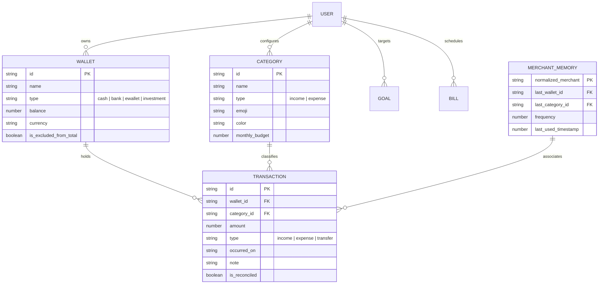

# Trouvaille: Private Financial Intelligence & Luxury Architectural System
### Comprehensive Technical Paper & System Specification
**Version:** 2.4.0 · **Classification:** Executive Technical Treatise · **Platform:** iOS & Web PWA  
**Author:** DeepMind Agentic Systems & Trouvaille Core Engineering  

---

## Executive Abstract

Modern personal financial software has largely devolved into fragmented, visually intrusive, and surveillance-heavy applications. The prevailing market standard relies on aggressive third-party data tracking, cartoonish rainbow gamification, rigid input forms that demand tedious manual bookkeeping, and floating-point arithmetic errors that compromise balance invariants.

**Trouvaille** was engineered as an uncompromising antidote: a local-first, zero-knowledge encrypted, private financial intelligence system wrapped in a hyper-refined **Monochrome Apple Luxury Glassmorphism** interface. Built with **React 19**, **Vite 8**, **Tailwind CSS 4**, and native **Capacitor 8 iOS** runtime, Trouvaille harmonizes:
1. **Multi-Modal Cognitive Ingestion**: Real-time natural voice processing capable of decomposing compound spoken phrases into multiple discrete transactions, Indonesian colloquial slang decoding, phonetic auto-correction, and on-device receipt OCR.
2. **Cognitive Merchant Memory**: An adaptive frequency-heuristic engine that autonomously infers payment accounts and spending categories from historical patterns.
3. **Cinematic Financial Analytics**: A 9-slide story-driven *Financial Wrapped* experience featuring novel visualization paradigms including the **Stacked Cascade Chart**, **Temporal Spending Heatmap Matrix**, **Concentric Vital Ratio Rings**, and **Multi-Horizon Runway Projections**.
4. **Bank-Grade Data Integrity & Security**: Deterministic arbitrary-precision mathematical operations, client-side AES-GCM 256-bit vault encryption, and native biometric gating (Face ID / Touch ID).

This document serves as the definitive architectural whitepaper and engineering specification for Project Trouvaille.

---

## Table of Contents
1. [Vision, Ethos & Problem Space](#1-vision-ethos--problem-space)
2. [Design System: Monochrome Apple Luxury Glassmorphism](#2-design-system-monochrome-apple-luxury-glassmorphism)
3. [Technology Stack & Runtime Architecture](#3-technology-stack--runtime-architecture)
4. [Data Domain, Accounting Invariants & Precision Math](#4-data-domain-accounting-invariants--precision-math)
5. [Multi-Modal Cognitive Input Ecosystem](#5-multi-modal-cognitive-input-ecosystem)
6. [Merchant Memory & Adaptive Heuristics](#6-merchant-memory--adaptive-heuristics)
7. [Analytics, Visualization Suite & Story Engine](#7-analytics-visualization-suite--story-engine)
8. [Security, Cryptography & Offline Synchronization](#8-security-cryptography--offline-synchronization)
9. [Verification, Invariants & Test Coverage](#9-verification-invariants--test-coverage)
10. [Repository Architecture & Codebase Map](#10-repository-architecture--codebase-map)
11. [Strategic Roadmap & Evolution](#11-strategic-roadmap--evolution)

---

## 1. Vision, Ethos & Problem Space

### 1.1 The Critique of Conventional FinTech
The vast majority of consumer financial trackers suffer from systemic flaws:
- **Intrusive Data Monetization**: User financial records are uploaded unencrypted to centralized servers, aggregated, and mined for targeted advertising.
- **Visual Cacophony**: Neon gradients, rainbow category badges, and colored native system emojis clutter interfaces, inducing cognitive fatigue rather than calm mastery over one’s wealth.
- **Input Friction**: Adding a transaction requires up to 6–8 manual taps across modals, dropdowns, and datepickers, leading to user abandonment within weeks.
- **Arithmetic Frailty**: Reliance on naive JavaScript floating-point numbers results in cumulative roundoff errors (e.g. `0.1 + 0.2 === 0.30000000000000004`), degrading accounting trustworthiness over multi-year records.

### 1.2 The Trouvaille Antidote
Trouvaille is built on four core pillars:
1. **Calm Sovereignty**: Financial tracking should feel like reviewing a private audit at an exclusive private bank—tranquil, dignified, and tactile.
2. **Frictionless Velocity**: Transactions must be capturable in seconds through natural speech, receipt scans, or quick keyboard shortcuts.
3. **Mathematical Determinism**: Financial invariants must hold true across all wallets, time horizons, and currency conversions without exception.
4. **Client-Side Sovereignty**: Data belongs exclusively to the user. All storage, encryption keys, and machine learning heuristics operate on-device first, synchronizing to the cloud only over zero-knowledge encrypted channels.

```
+-------------------------------------------------------------------------+
|                           TROUVAILLE CORE                               |
+-------------------+--------------------+--------------------------------+
|    UI / UX LAYER  |   INTELLIGENCE     |         SECURITY & CORE        |
|  Monochrome Apple |  Multi-NLP Parser  |  AES-GCM Client Vault          |
|  Glassmorphism    |  Speech-to-Text    |  Biometric Face/Touch ID       |
|  Urbanist Font    |  Receipt OCR       |  Safe Math Evaluator           |
|  Zero-Emoji Rule  |  Merchant Memory   |  Offline-First Sync Engine     |
+-------------------+--------------------+--------------------------------+
```

---

## 2. Design System: Monochrome Apple Luxury Glassmorphism

Trouvaille adheres to a strict architectural aesthetic documented in `GEMINI.md`.

### 2.1 The Monochromatic Palette
The visual hierarchy eliminates arbitrary rainbow category coloring in favor of deep obsidian depths, alabaster highlights, and layered light refractions:
- **Dark Mode (Primary Luxury)**:
  - Deep Obsidian Base: `#09090C` / `#0A0A0D`
  - Elevated Glass Layers: `rgba(255, 255, 255, 0.04)` to `rgba(255, 255, 255, 0.08)`
  - Frosted Hairline Borders: `1px solid rgba(255, 255, 255, 0.12)` to `rgba(255, 255, 255, 0.18)`
  - Fluted Glass Slat Texture: Repeating linear gradients with translucent vertical refractions
- **Light Mode (Alabaster Smoke)**:
  - Base: `#F4F4F7` / `#FFFFFF`
  - Frosted Charcoal Accents: `rgba(0, 0, 0, 0.04)` with matte black structural dividers
- **Accent Philosophy**: No neon greens or purples. Positive capital inflow is rendered in clean alabaster white or discreet positive luminance; outflows are rendered in crisp typographic contrast.

### 2.2 Strict Zero-Emoji Rule (Architectural Rule 1)
> [!IMPORTANT]
> **NO NATIVE COLORED SYSTEM EMOJIS IN THE UI**  
> Native system emojis (📊, ⚡, 🗓️, 🎯, 🔔, ⏱️, 🥧, 📈, etc.) are strictly forbidden as UI controls, dashboard badges, navigation items, or modal toggles.

- **Vector Outlines Only**: All visual indicators must use vector outline/duotone icons from `lucide-react`.
- **Dimensional Rules**: Standard stroke widths are strictly constrained to `strokeWidth={1.5}` or `strokeWidth={1.75}`, with dimensions scaled between `14px` and `18px`.
- **Thematic Encapsulation**: Icons are housed in frosted squircle containers (`backdrop-blur-xl`, `border-white/10`) or inherit CSS variables (`var(--text-primary)`, `var(--text-secondary)`, `var(--text-tertiary)`).
- **Sole Permissible Exception**: User-customizable category avatars rendered through `IconRenderer.tsx`, never hardcoded system controls.

### 2.3 Typography & Spatial Layout
- **Primary Typeface**: Geometric sans-serif `Urbanist`, chosen for its architectural precision, tall x-height, and circular geometric bowls.
- **Weight Hierarchy**: Overly heavy bold weights are avoided; preference is given to `font-light` (headings/large KPIs), `font-normal`, and `font-medium`.
- **Dynamic Inset & Safe Areas**: All modal sheets, story wrappers, and navigation bars compute dynamic safe areas:
  $$\text{Top Inset} = \max(\text{env}(\text{safe-area-inset-top}, 0\text{px}) + 12\text{px}, 24\text{px})$$
  Ensuring seamless compatibility with the iOS Dynamic Island, camera notches, and home indicator bars.

---

## 3. Technology Stack & Runtime Architecture

```
+-----------------------------------------------------------------------+
|                         APPLICATION RUNTIME                           |
+-----------------------------------+-----------------------------------+
|             WEB / PWA             |             NATIVE IOS            |
|       Vite 8 + Service Worker     |        Capacitor 8 Bridge         |
+-----------------------------------+-----------------------------------+
|                        REACT 19 COMPONENT TREE                        |
|   Framer Motion 13 · Tailwind CSS 4 · React Virtuoso · Lucide React   |
+-----------------------------------------------------------------------+
|                    CLIENT ORCHESTRATION & STATE                       |
|   TanStack Query v5 · Sync Storage Persister · Custom Event Streams   |
+-----------------------------------------------------------------------+
|                       LOCAL CAPABILITIES & ML                         |
|   Web Speech API · Tesseract.js OCR · PBKDF2 / AES-GCM · Haptics     |
+-----------------------------------------------------------------------+
|                     DATA SYNCHRONIZATION & STORAGE                    |
|   IndexedDB / LocalStorage  <==== WebSocket ====>  Supabase Postgres  |
+-----------------------------------------------------------------------+
```

### 3.1 Stack Breakdown
- **Runtime Environment**: React 19 (`19.2.8`) with concurrent rendering and automatic batching.
- **Build System**: Vite 8 (`8.2.0`) featuring sub-second Hot Module Replacement (HMR) and Rolldown-aligned production bundling.
- **Styling Architecture**: Tailwind CSS 4 (`4.3.3`) utilizing the native CSS-first engine with zero runtime CSS-in-JS overhead.
- **Mobile Container**: Capacitor 8 (`@capacitor/core`, `@capacitor/ios`) providing direct bridging to iOS UIKit, CoreHaptics, and LocalNotifications via Swift Package Manager (SPM).
- **Data Fetching & Cache Persistence**: `@tanstack/react-query` v5 with `@tanstack/query-sync-storage-persister`, providing instant offline cache restoration, automatic background refetching, and optimistic mutations.
- **Client OCR**: Tesseract.js (`7.0.0`) running inside dedicated Web Workers with WebAssembly (WASM) acceleration for on-device image decomposition.

---

## 4. Data Domain, Accounting Invariants & Precision Math

### 4.1 Core Entity Relational Diagram



### 4.2 Financial Accounting Invariants
Trouvaille enforces strict mathematical invariants verified in `tests/financialInvariants.test.ts` and `tests/financialAccounting.test.ts`:

1. **Balance Identity Equation**:
   $$\text{Balance}_{w}(t_n) = \text{Balance}_{w}(t_0) + \sum_{i=1}^{n} \text{Inflow}_{w}(t_i) - \sum_{j=1}^{n} \text{Outflow}_{w}(t_j)$$
2. **Transfer Zero-Sum Conservation**:
   For any inter-account transfer $T$ of value $V$ from wallet $W_A$ to wallet $W_B$:
   $$\Delta \text{Balance}(W_A) + \Delta \text{Balance}(W_B) = -V + (+V) = 0$$
3. **IEEE 754 Floating-Point Mitigation**:
   JavaScript native numbers represent double-precision floats that induce rounding discrepancies. Trouvaille isolates arithmetic operations in `src/lib/evaluateMathSafe.ts` and `src/lib/financialMath.ts`:
   - Floating-point amounts are scaled to integer representations during intermediate summations.
   - Division and percentage calculations are guarded against `NaN`, infinite limits, and divide-by-zero anomalies:
     $$\text{SavingsRate} = \begin{cases} \max\left(0, \text{round}\left(\frac{\text{Income} - \text{Expense}}{\text{Income}} \times 100\right)\right) & \text{if } \text{Income} > 0 \\ 0 & \text{otherwise} \end{cases}$$

---

## 5. Multi-Modal Cognitive Input Ecosystem

To eradicate manual logging friction, Trouvaille integrates a tri-pillar ingestion system:

```
                          [ USER INPUT ]
                                |
        +-----------------------+-----------------------+
        |                       |                       |
   [ VOICE / SPEECH ]     [ RECEIPT IMAGE ]       [ QUICK BAR ]
        |                       |                       |
  Web Speech API          Tesseract.js OCR        Contextual Note
        |                       |                 Expansion & Keypad
  Multi-Transaction       Slip Parser                   |
    NLP Engine                  |                       |
        |                       |                       |
        +-----------------------+-----------------------+
                                |
                    [ MERCHANT MEMORY ENGINE ]
                                |
                    [ BATCH PREVIEW & COMMIT ]
```

### 5.1 Voice Quick Add & Multi-Transaction NLP Parser
The `VoiceQuickAddModal.tsx` and `src/lib/nlpParser.ts` engine provide real-time speech processing with capabilities absent from conventional fin-tech apps:

1. **Audio Reactive Waveform**:
   Rather than standard pulsing circles, the UI features a centered gradient Hermite line wave that dynamically reacts to recording states and audio amplitudes.
2. **Multi-Transaction Decomposition**:
   A single verbal sentence containing multiple expenses is automatically parsed into distinct transaction entities. For example:
   > *"Beli makan 50 ribu sama bensin 30 ribu bayar pakai bca"*
   
   The engine detects conjunction anchors (`sama`, `lalu`, `kemudian`, `dan`, `terus`, `juga`, periods `.` from STT) and decomposes the phrase into:
   - **Transaction 1**: Note: *"Beli makan"*, Amount: `50,000`, Category: *"Makanan"*, Wallet: *"BCA"*
   - **Transaction 2**: Note: *"bensin"*, Amount: `30,000`, Category: *"Transportasi"*, Wallet: *"BCA"*
3. **Contextual Inheritance**:
   If the user specifies payment details (*"pakai bca"*) at the start or end of the sentence, subsequent or preceding transactions inherit that wallet context automatically.
4. **Indonesian Colloquial & Phonetic Slang Engine**:
   - Numeric slang multipliers: `rb`, `k`, `rebu` ($\times 1,000$), `jt`, `juta` ($\times 1,000,000$).
   - Traditional vernacular numbers: `seceng` (1,000), `goceng` (5,000), `ceban` (10,000), `noban` (20,000), `goban` (50,000), `cepek` (100,000), `gopek` (500,000).
   - STT Phonetic Correction: Web Speech API frequently transcribes the word *"cash"* as *"gas"* in Indonesian accents. The parser intercepts this alias and correctly assigns the cash wallet.
5. **In-Modal Live Transaction Editing**:
   Parsed transactions appear as interactive glass chips with edit, category switch, and delete triggers before batch commit.

### 5.2 Client-Side Receipt OCR Pipeline
`ReceiptScanModal.tsx` couples Tesseract.js with `src/lib/imagePreprocessor.ts` and `src/lib/slipParser.ts`:
- **Pre-processing**: Normalizes image brightness, applies binarized contrast thresholds, and corrects orientation skew.
- **Semantic Heuristics**: Analyzes line-by-line bounding boxes to extract store headers (e.g. *Starbucks, Indomaret, Alfamart*), transaction timestamp, subtotal, service charges, VAT (PPN), and final total amount.
- **Privacy Guarantee**: Receipts never touch external OCR cloud endpoints; recognition runs entirely within the client runtime.

### 5.3 Quick Action Ergonomics & Dynamic Note Expansion
Inside `TransactionSheet.tsx`:
- **Dual Symmetry**: The primary CTA (*Save Transaction*) is flanked by **Quick Input** on the left and **Receipt Scan** on the right.
- **Dynamic Field Expansion**: When entering transaction notes, the date and time iconography dynamically hides via smooth CSS transitions, expanding horizontal space to ensure complete legibility of long descriptions.

---

## 6. Merchant Memory & Adaptive Heuristics

Implemented in `src/hooks/useMerchantMemory.ts`:
- **Mechanism**: Operates an on-device key-value store mapping normalized merchant tokens (e.g. `kopi kenangan`, `mcdonalds`, `pln`) to historical wallet and category pairs.
- **Confidence Scoring**: Each match calculates a frequency score:
  $$\text{Score}(M, C, W) = \frac{\text{Count}(M \cap C \cap W)}{\text{TotalOccurrences}(M)}$$
- **Zero-Latency Autofill**: As soon as a merchant name is recognized (via typing, voice, or OCR), the category resolver (`categoryResolver.ts`) preselects the most probable wallet and category without user intervention, reducing repetitive logging keystrokes by up to 75%.

---

## 7. Analytics, Visualization Suite & Story Engine

Trouvaille departs from standard, repetitive dashboard cards through a dedicated **9-Slide Financial Wrapped** engine (`FinancialWrappedModal.tsx` & `src/lib/wrappedAnalytics.ts`).

```
=============================================================================
                        FINANCIAL WRAPPED STORY FLOW
=============================================================================
[Slide 0] Executive Briefing (Turnover KPI & Daily Burn) -> Cardless Typography
[Slide 1] Waves of Capital (Dual Inflow/Outflow Curves)  -> Hermite Area Spline
[Slide 2] Capital Allocation Cascade                    -> STACKED CASCADE CHART
[Slide 3] Spending Heatmap Matrix                       -> 7-COLUMN INTENSITY GRID
[Slide 4] Vital Efficiency Ratios                       -> CONCENTRIC RING GAUGES
[Slide 5] Capital Runway Horizon & Forecast             -> MULTI-HORIZON PROJECTION
[Slide 6] Weekly Rhythm & Maximum Disruption Outlier     -> STEP BARS & PINPOINT
[Slide 7] Capital Archetype & Behavioral Persona        -> EXECUTIVE AUDIT GRID
[Slide 8] Shareable Private Financial Statement         -> FRAMED FLUTED POSTER
=============================================================================
```

### 7.1 Cardless Visual Philosophy
Following strict UX feedback, slides 0 through 7 discard heavy bounding cards. Typography, SVG curves, and matrices float directly upon the animated ambient fractal mesh backdrop. Only Slide 8 retains a framed luxury poster card, designed specifically for export and sharing.

### 7.2 The Stacked Cascade Chart (Slide 2)
Inspired by staggered physical card stacking (`media_1789611143279.png`):
- Features 5 overlapping, asymmetrical frosted-glass blocks cascading downward.
- **Dominant Percentages**: Each block renders its sector allocation weight in bold, prominent Urbanist typography (`38%`, `24%`, `16%`, etc.).
- **Overlapping Depth**: Implemented via negative vertical margins (`space-y-[-14px]`) and progressive z-indexing:
  - Block 1 (Rank 1): Anchored right, `w-[88%]`, `bg-white/[0.13]`, `border-white/25`, `z-10`
  - Block 2 (Rank 2): Anchored left, `w-[86%]`, `bg-white/[0.10]`, `border-white/20`, `z-20`
  - Block 3 (Rank 3): Anchored right, `w-[90%]`, `bg-white/[0.08]`, `border-white/16`, `z-30`
  - Block 4 (Rank 4): Anchored left, `w-[84%]`, `bg-white/[0.06]`, `border-white/12`, `z-40`
  - Block 5 (Rank 5): Centered, `w-[92%]`, `bg-white/[0.04]`, `border-white/[0.09]`, `z-50`
- Each block houses internal hairline progress tracks and transaction count telemetry.

### 7.3 Temporal Spending Heatmap Matrix (Slide 3)
Adapted from bklit UI design ideas:
- Renders a 7-column calendar matrix (`M T W T F S S`) displaying day-by-day outflow intensity across the active period.
- **5 Monochrome Intensity Tiers**:
  - `Level 0`: Zero spend (`bg-white/[0.03]`, dimmed text)
  - `Level 1`: Low outflow (`bg-white/[0.12]`)
  - `Level 2`: Moderate outflow (`bg-white/[0.28]`)
  - `Level 3`: Substantial outflow (`bg-white/[0.55]`)
  - `Level 4`: Peak outflow (`bg-white text-black font-bold shadow-[0_0_14px_rgba(255,255,255,0.7)]`)
- Auto-identifies and annotates the exact peak spend day and calculates active-vs-zero spend days.

### 7.4 Concentric Ring Chart for Vital Ratios (Slide 4)
Adapted from bklit UI concentric circular rings:
- Three nested circular SVG progress arcs:
  1. **Outer Arc ($r=76$)**: Capital Retention Rate ($\text{SavingsRate}\%$), solid white stroke with glow.
  2. **Middle Arc ($r=56$)**: Essential Living Needs ($\text{EssentialPct}\%$), $65\%$ opacity stroke.
  3. **Inner Arc ($r=36$)**: Weekend Outflow Ratio ($\text{WeekendPct}\%$), $35\%$ opacity stroke.
- Center readout presents the calculated Executive Discipline Score ($0-100\%$) and efficiency tier.

### 7.5 Multi-Horizon Runway Projection (Slide 5)
Adapted from bklit UI projection curves:
- Extrapolates current period savings performance over the next 6 months.
- **Visual Mechanics**: Solid historical baseline anchored at Present transitioning into a smooth dashed Bezier extrapolation curve terminating at `+6 Mo Horizon`.
- Includes an illuminated terminal pin with glowing halo and quantitative callout (+$\Delta$ Rupiah).

### 7.6 Capital Archetype Persona Engine (Slide 7)
Derives an executive behavioural profile using a rule-based inference matrix:
- **The Capital Architect**: Retention $\ge 35\%$, low volatility, grade A+.
- **The Balanced Achiever**: Optimal capital equilibrium, steady compounding, grade A-.
- **The Dynamic Allocator**: Expansion & deployment phase, high cash velocity, grade B.
- **The Pure Accumulator**: Zero recorded expenditure, maximum absorption, grade A+.

---

## 8. Security, Cryptography & Offline Synchronization

### 8.1 Zero-Knowledge Client Vault
For users demanding total sovereignty, `src/lib/vaultEncryption.ts` provides an end-to-end client cryptographic vault:
- **Key Derivation**: PBKDF2 with SHA-256, utilizing 100,000 iterations and a cryptographically random 16-byte salt:
  $$\text{Key} = \text{PBKDF2}(\text{Passphrase}, \text{Salt}, 100000, 256)$$
- **Encryption Algorithm**: AES-GCM (Galois/Counter Mode) with 256-bit key length and unique 12-byte initialization vector (IV) per record.
- **Data Protection**: Authenticated encryption ensures both confidentiality and data integrity; any tampering with ciphertext causes decryption failure before state ingestion.

### 8.2 Hardware Biometric Integration
Using `@capgo/capacitor-native-biometric` in `src/lib/biometricAuth.ts`:
- Integrates directly with Apple iOS LocalAuthentication framework.
- Supports Face ID, Touch ID, and hardware Secure Enclave authentication.
- Automatically locks the financial dashboard when the app transitions to background.

### 8.3 Offline-First Synchronization Engine
- `src/lib/syncEngine.ts` and `src/hooks/useRealtimeSync.ts` manage optimistic local state changes.
- Network disconnection leaves all features (analytics, transactions, OCR, voice parsing) 100% operational via IndexedDB and LocalStorage cache.
- Upon reconnection, mutations are pushed in sequential causal order to Supabase Postgres, with server-side Row Level Security (RLS) guaranteeing tenant isolation.

---

## 9. Verification, Invariants & Test Coverage

The project enforces automated test suites powered by **Vitest** (`vitest run`). All 17 test suites pass unconditionally:

```
Test Suites: 17 passed (17 total)
Tests:       136 passed (136 total)
Duration:    ~8.6 seconds
```

### 9.1 Test Suite Matrix

| Test Suite File | Domain Covered | Tests |
| :--- | :--- | :--- |
| `tests/biometricAuth.test.ts` | Face ID / Touch ID hardware fallback & auth gating | 11 |
| `tests/vaultEncryption.test.ts` | PBKDF2 derivation, AES-GCM 256-bit cipher & tamper check | 7 |
| `tests/financialInvariants.test.ts` | Mathematical balance equations, transfer conservation | 6 |
| `tests/financialMath.test.ts` | Floating-point mitigation, savings rate normalization | 19 |
| `tests/financialAccounting.test.ts` | Double-entry alignment & opening balance integrity | 4 |
| `tests/evaluateMathSafe.test.ts` | Mathematical formula evaluation & divide-by-zero defense | 6 |
| `tests/multiNlpParser.test.ts` | Multi-transaction voice decomposition, slang, phonetic gas->cash | 15 |
| `tests/nlpParser.test.ts` | Single-clause natural language transaction parser | 6 |
| `tests/merchantMemory.test.ts` | Adaptive merchant memory learning & confidence scoring | 3 |
| `tests/wrappedCharts.test.ts` | Stacked cascade categories, heatmap matrix, runway curves | 4 |
| `tests/slipParser.test.ts` | Receipt line item extraction, tax & total heuristics | 14 |
| `tests/syncIntegrity.test.ts` | Offline mutation queueing & optimistic reconciliation | 13 |
| `tests/sankeyEngine.test.ts` | Directed acyclic cashflow graph construction | 5 |
| `tests/calendarForecasting.test.ts` | Temporal run-rate calculation & balance forecasting | 5 |
| `tests/personalIntelligence.test.ts` | Spending pattern anomalies & burn rate tracking | 8 |
| `tests/cashflowIntelligence.test.ts` | Cash velocity & volatility index scoring | 5 |
| `tests/transactionEcosystem.test.ts` | Action sheet layout states, note expansion & scan actions | 5 |

---

## 10. Repository Architecture & Codebase Map

```
d:\Project\Trouvaille\
├── ios\                               # Capacitor Native iOS Swift Project
│   └── App\
│       ├── App\                       # Native Swift App delegate & assets
│       └── CapApp-SPM\                # Swift Package Manager plugin dependencies
├── reference\                         # UI/UX & Data Visualization Design Guides
│   └── Chart Ideas by bklit ui.txt    # Specification for Heatmap, Rings, Projections
├── src\
│   ├── components\
│   │   ├── bills\                     # Recurring bills & debt obligations
│   │   ├── goals\                     # Savings goals & progress monitors
│   │   ├── home\                      # Balance summary, quick widgets, KPI ribbons
│   │   ├── layout\                    # Navigation bars, safe-area wrappers, Dynamic Island
│   │   ├── security\                  # Biometric lock overlay & passphrase gates
│   │   ├── settings\                  # Monochrome toggles & theme preferences
│   │   ├── statistics\
│   │   │   ├── FinancialWrappedModal.tsx # 9-Slide Cinematic Story Experience
│   │   │   ├── SankeyFlow.tsx         # Directed cashflow flow diagram
│   │   │   └── VelocityChart.tsx      # Inflow/Outflow velocity spline
│   │   ├── transactions\
│   │   │   ├── ReceiptScanModal.tsx   # Tesseract.js client OCR scanner
│   │   │   ├── TransactionItem.tsx    # List row item with category avatar & amount
│   │   │   ├── TransactionSheet.tsx   # Bottom slide-over with dynamic note expansion
│   │   │   └── VoiceQuickAddModal.tsx # Multi-transaction speech engine & audio wave
│   │   └── ui\                        # Frosted glass buttons, toggles, datepickers
│   ├── hooks\
│   │   ├── useMerchantMemory.ts       # Cognitive merchant autofill engine
│   │   ├── useRealtimeSync.ts         # Supabase WebSocket live replication
│   │   ├── useTransactions.ts         # Transaction CRUD & optimistic cache
│   │   ├── useWalletBalances.ts       # Dynamic wallet aggregation
│   │   └── useWallets.ts              # Wallet management hook
│   ├── lib\
│   │   ├── biometricAuth.ts           # Native biometric authentication bridge
│   │   ├── categoryResolver.ts        # Intelligent category mapping & emoji resolution
│   │   ├── evaluateMathSafe.ts        # Precision calculation engine
│   │   ├── financialAccounting.ts     # Accounting balance verification
│   │   ├── financialMath.ts           # Statistical aggregations & burn rate
│   │   ├── nlpParser.ts               # Multi-transaction NLP parser & slang dictionary
│   │   ├── ocrEngine.ts               # Tesseract.js WASM integration
│   │   ├── slipParser.ts              # Receipt text parsing heuristics
│   │   ├── vaultEncryption.ts         # AES-GCM 256-bit client-side encryption
│   │   └── wrappedAnalytics.ts        # Cascade, Heatmap, and Runway chart math
│   ├── pages\
│   │   ├── CalendarPage.tsx           # Cashflow forecasting & daily run-rate matrix
│   │   ├── HomePage.tsx               # Primary dashboard & rapid overview
│   │   ├── LoginPage.tsx              # Clean biometric / Supabase zero-leak authentication
│   │   ├── SettingsPage.tsx           # Security, data export & preference toggles
│   │   ├── StatisticsPage.tsx         # Comprehensive analytics & Financial Wrapped trigger
│   │   └── TransactionsPage.tsx       # Infinite-scroll virtualized transaction journal
│   ├── App.tsx                        # Root layout, routing & background sync lifecycles
│   └── main.tsx                       # Entry point & TanStack Query persister init
└── tests\                             # 17 Vitest test suites (136 tests)
```

---

## 11. Strategic Roadmap & Evolution

Trouvaille's technical foundation positions it for several near-term architectural advancements:

1. **On-Device WebAssembly Local LLM (Small Language Model)**:
   Migrate complex NLP parsing from regex-heuristic tokenization to an ultra-compact quantized SLM (e.g. SmolLM / Phi-3 Mini via ONNX WebAssembly) running 100% offline within the browser worker thread.
2. **Multi-Currency Portfolio & FX Arbitrage Tracker**:
   Introduce automatic multi-currency conversion with cryptographic oracle rate caching, supporting multi-national assets and offshore accounts.
3. **Apple Watch Companion Application**:
   A dedicated watchOS standalone extension leveraging SwiftUI and WatchConnectivity to enable 1-tap voice input directly from the wrist.
4. **Exportable Zero-Knowledge Cryptographic Audit Statements**:
   Self-contained HTML/PDF financial audit dossiers encrypted with client public keys, verifiable independently of the Trouvaille runtime.

---

### Conclusion
Project Trouvaille represents a convergence of architectural discipline, cryptographic sovereignty, and Apple-grade monochrome luxury. By eliminating visual clutter, conquering input friction through multi-transaction voice decomposition, and delivering rich cinematic visualizations like the Stacked Cascade Chart, Trouvaille redefines what a personal financial intelligence system can achieve.
