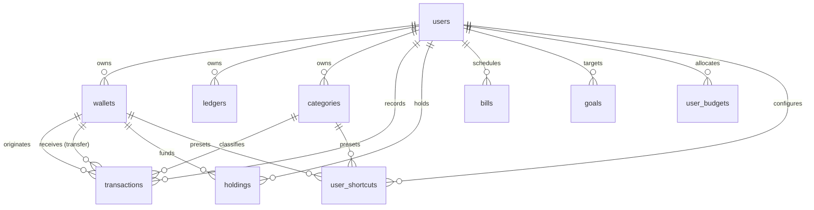

# Trouvaille Supabase Database Schema Specification
**Canonical Reference Document · Production Cloud Schema**
*Last Synchronized: 24 September 2026*

This document serves as the absolute single source of truth for the Trouvaille production database hosted on Supabase (PostgreSQL 15+).

---

## 1. Overview of Core Entities

The Trouvaille architecture organizes personal financial data into 9 core tables:



---

## 2. Table Specifications & DDL

### 1. `public.wallets` (Accounts & Liquid Vaults)
Stores cash accounts, bank accounts, and e-wallets.

```sql
create table public.wallets (
  id uuid not null default gen_random_uuid (),
  user_id uuid not null,
  name text not null,
  icon text not null,
  created_at timestamp with time zone null default now(),
  classification text null default 'liquid'::text,
  constraint wallets_pkey primary key (id),
  constraint wallets_user_id_name_key unique (user_id, name),
  constraint wallets_user_id_fkey foreign KEY (user_id) references auth.users (id)
) TABLESPACE pg_default;

create index IF not exists idx_wallets_user_id on public.wallets using btree (user_id) TABLESPACE pg_default;
```

---

### 2. `public.categories` (Spending & Income Categories)
Stores user-customizable income and expense categories with icon/emoji mappings.

```sql
create table public.categories (
  id uuid not null default gen_random_uuid (),
  user_id uuid not null default auth.uid (),
  name text not null,
  emoji text not null,
  type text not null,
  is_default boolean null default false,
  created_at timestamp with time zone null default now(),
  constraint categories_pkey primary key (id),
  constraint categories_user_id_fkey foreign KEY (user_id) references auth.users (id),
  constraint categories_type_check check (
    (
      type = any (
        array['income'::text, 'expense'::text, 'transfer'::text]
      )
    )
  )
) TABLESPACE pg_default;

create index IF not exists idx_categories_user_id on public.categories using btree (user_id) TABLESPACE pg_default;
```

---

### 3. `public.ledgers` (Multi-Ledger Spaces)
Supports segregation of personal, business, joint, and project accounts.

```sql
create table public.ledgers (
  id text not null,
  user_id uuid not null,
  name text not null,
  description text null,
  icon text null default 'BookOpen'::text,
  currency text null default 'IDR'::text,
  is_default boolean null default false,
  created_at timestamp with time zone null default now(),
  updated_at timestamp with time zone null default now(),
  constraint ledgers_pkey primary key (id),
  constraint ledgers_user_id_fkey foreign KEY (user_id) references auth.users (id) on delete CASCADE
) TABLESPACE pg_default;

create index IF not exists idx_ledgers_user_id on public.ledgers using btree (user_id, created_at) TABLESPACE pg_default;
```

---

### 4. `public.transactions` (Financial Journal Entries)
Immutable and ledger-partitioned financial transaction records.

```sql
create table public.transactions (
  id uuid not null default gen_random_uuid (),
  user_id uuid not null default auth.uid (),
  category_id uuid null,
  type text not null,
  amount numeric(14, 2) not null,
  note text null,
  occurred_on date not null default CURRENT_DATE,
  created_at timestamp with time zone null default now(),
  wallet_id uuid null,
  to_wallet_id uuid null,
  ledger_id text null default 'personal'::text,
  constraint transactions_pkey primary key (id),
  constraint transactions_category_id_fkey foreign KEY (category_id) references categories (id) on delete set null,
  constraint transactions_to_wallet_id_fkey foreign KEY (to_wallet_id) references wallets (id),
  constraint transactions_user_id_fkey foreign KEY (user_id) references auth.users (id),
  constraint transactions_wallet_id_fkey foreign KEY (wallet_id) references wallets (id),
  constraint transactions_amount_check check ((amount > (0)::numeric)),
  constraint transactions_type_check check (
    (
      type = any (
        array['income'::text, 'expense'::text, 'transfer'::text]
      )
    )
  )
) TABLESPACE pg_default;

create index IF not exists idx_transactions_category_id on public.transactions using btree (category_id) TABLESPACE pg_default;
create index IF not exists idx_transactions_wallet_id on public.transactions using btree (wallet_id) TABLESPACE pg_default;
create index IF not exists idx_transactions_to_wallet_id on public.transactions using btree (to_wallet_id) TABLESPACE pg_default;
create index IF not exists idx_transactions_user_occurred_created on public.transactions using btree (user_id, occurred_on desc, created_at desc) TABLESPACE pg_default;
create index IF not exists idx_transactions_user_type_date on public.transactions using btree (user_id, type, occurred_on desc) TABLESPACE pg_default;
create index IF not exists idx_transactions_user_ledger_date on public.transactions using btree (user_id, ledger_id, occurred_on desc) TABLESPACE pg_default;
```

---

### 5. `public.holdings` (Investment & Net Worth Portfolio)
Tracks digital assets, crypto (BTC, USDT), stocks, gold, and fixed assets displayed on Executive Balance Sheet & Wallet Cards.

```sql
create table public.holdings (
  id uuid not null default gen_random_uuid (),
  user_id uuid not null,
  symbol text not null,
  name text not null,
  asset_type text not null default 'crypto'::text,
  units numeric not null default 0,
  avg_buy_price numeric not null default 0,
  current_price numeric not null default 0,
  currency text null default 'IDR'::text,
  notes text null,
  icon text null default 'TrendingUp'::text,
  annual_rate numeric null,
  purchase_date date null,
  wallet_id uuid null,
  last_price_updated_at timestamp with time zone null default now(),
  created_at timestamp with time zone null default now(),
  updated_at timestamp with time zone null default now(),
  constraint holdings_pkey primary key (id),
  constraint holdings_user_id_fkey foreign KEY (user_id) references auth.users (id) on delete CASCADE,
  constraint holdings_wallet_id_fkey foreign KEY (wallet_id) references wallets (id) on delete set null
) TABLESPACE pg_default;

create index IF not exists idx_holdings_user_id on public.holdings using btree (user_id) TABLESPACE pg_default;
create index IF not exists idx_holdings_user_symbol on public.holdings using btree (user_id, symbol) TABLESPACE pg_default;
create index IF not exists idx_holdings_asset_type on public.holdings using btree (user_id, asset_type) TABLESPACE pg_default;
```

---

### 6. `public.bills` (Recurring Subscriptions & Obligations)
Tracks recurring obligations, loans, and subscriptions.

```sql
create table public.bills (
  id uuid not null default gen_random_uuid (),
  user_id uuid not null default auth.uid (),
  title text not null,
  amount numeric(14, 2) null,
  due_date date not null,
  repeat_rule text not null default 'none'::text,
  is_paid boolean null default false,
  note text null,
  created_at timestamp with time zone null default now(),
  constraint bills_pkey primary key (id),
  constraint bills_user_id_fkey foreign KEY (user_id) references auth.users (id),
  constraint bills_repeat_rule_check check (
    (
      repeat_rule = any (
        array[
          'none'::text,
          'weekly'::text,
          'monthly'::text,
          'yearly'::text
        ]
      )
    )
  )
) TABLESPACE pg_default;

create index IF not exists idx_bills_user_due_date on public.bills using btree (user_id, due_date) TABLESPACE pg_default;
```

---

### 7. `public.goals` (Savings Goals & Milestones)
Monitors target savings and financial milestone accumulation.

```sql
create table public.goals (
  id uuid not null default gen_random_uuid (),
  user_id uuid not null,
  title text not null,
  target_amount numeric not null default 0,
  current_amount numeric not null default 0,
  icon text null,
  color text null,
  target_date text null,
  created_at timestamp with time zone null default now(),
  constraint goals_pkey primary key (id),
  constraint goals_user_id_fkey foreign KEY (user_id) references auth.users (id) on delete CASCADE
) TABLESPACE pg_default;

create index IF not exists idx_goals_user_id on public.goals using btree (user_id) TABLESPACE pg_default;
```

---

### 8. `public.user_budgets` (Monthly Budget Thresholds)
Persists monthly spending limits per user.

```sql
create table public.user_budgets (
  id uuid not null default gen_random_uuid (),
  user_id uuid not null,
  target_amount numeric not null default 0,
  month text null,
  updated_at timestamp with time zone null default now(),
  constraint user_budgets_pkey primary key (id),
  constraint user_budgets_user_id_fkey foreign KEY (user_id) references auth.users (id) on delete CASCADE
) TABLESPACE pg_default;

create index IF not exists idx_user_budgets_user_month on public.user_budgets using btree (user_id, month) TABLESPACE pg_default;
```

---

### 9. `public.user_shortcuts` (Quick Add Presets)
User-defined quick transaction macros with predefined amount, category, and wallet.

```sql
create table public.user_shortcuts (
  id uuid not null default gen_random_uuid (),
  user_id uuid not null,
  title text not null,
  amount numeric not null default 0,
  type text not null,
  category_id uuid null,
  wallet_id uuid null,
  note text null,
  created_at timestamp with time zone null default now(),
  constraint user_shortcuts_pkey primary key (id),
  constraint user_shortcuts_category_id_fkey foreign KEY (category_id) references categories (id) on delete set null,
  constraint user_shortcuts_user_id_fkey foreign KEY (user_id) references auth.users (id) on delete CASCADE,
  constraint user_shortcuts_wallet_id_fkey foreign KEY (wallet_id) references wallets (id) on delete set null,
  constraint user_shortcuts_type_check check (
    (
      type = any (
        array['expense'::text, 'income'::text, 'transfer'::text]
      )
    )
  )
) TABLESPACE pg_default;
```
